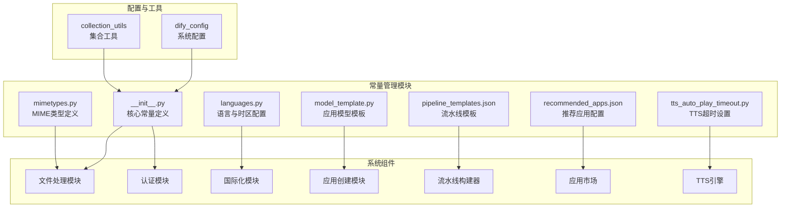

# api/constants目录分析报告

## 1. 核心作用

`api/constants` 目录是 Dify 系统中集中管理各类常量的核心模块，为整个应用提供统一、可维护的常量定义服务。其主要作用包括：

- **集中化常量管理**：将系统中使用的各种常量值统一存放，避免硬编码，提高代码可维护性
- **类型安全保障**：通过类型标注和集中定义，确保常量使用的一致性和正确性
- **配置化控制**：部分常量值根据系统配置动态生成，支持灵活的功能开关和行为调整
- **模块化组织**：按功能领域分类常量，便于查找和管理
- **跨模块共享**：作为公共依赖模块，为系统各组件提供统一的常量访问接口

## 2. 目录结构

```
api/constants/
├── __init__.py              # 核心常量定义，包括文件扩展名、Cookie名称等
├── languages.py             # 语言与时区映射配置
├── mimetypes.py             # MIME类型默认值定义
├── model_template.py        # 应用模型模板配置
├── pipeline_templates.json  # 流水线模板配置（JSON格式）
├── recommended_apps.json    # 推荐应用配置（JSON格式）
└── tts_auto_play_timeout.py # TTS自动播放超时设置
```

## 3. 文件分类与功能

### 3.1 核心常量定义文件

#### `__init__.py`

**主要功能**：定义系统核心常量，包括文件扩展名、Cookie名称、隐藏值等基础常量

**关键内容**：
- 文件扩展名常量：IMAGE_EXTENSIONS、VIDEO_EXTENSIONS、AUDIO_EXTENSIONS、DOCUMENT_EXTENSIONS
- Cookie名称常量：COOKIE_NAME_ACCESS_TOKEN、COOKIE_NAME_REFRESH_TOKEN等
- 特殊值常量：HIDDEN_VALUE、UNKNOWN_VALUE、UUID_NIL
- 配置依赖常量：根据dify_config.ETL_TYPE动态生成DOCUMENT_EXTENSIONS

**示例代码**：
```python
IMAGE_EXTENSIONS = convert_to_lower_and_upper_set({"jpg", "jpeg", "png", "webp", "gif", "svg"})
DOCUMENT_EXTENSIONS: set[str] = convert_to_lower_and_upper_set(_doc_extensions)
COOKIE_NAME_ACCESS_TOKEN = "access_token"
```

### 3.2 国际化相关常量

#### `languages.py`

**主要功能**：定义系统支持的语言和时区映射关系

**关键内容**：
- language_timezone_mapping：语言代码与时区的映射字典
- languages：支持的语言列表
- supported_language：语言有效性检查函数
- get_valid_language：获取有效语言的工具函数

**示例代码**：
```python
language_timezone_mapping = {
    "en-US": "America/New_York",
    "zh-Hans": "Asia/Shanghai",
    "zh-Hant": "Asia/Taipei",
    # ... 更多语言映射
}
```

### 3.3 媒体相关常量

#### `mimetypes.py`

**主要功能**：定义默认MIME类型和文件扩展名

**关键内容**：
- DEFAULT_MIME_TYPE：默认MIME类型（application/octet-stream）
- DEFAULT_EXTENSION：默认文件扩展名（.bin）

### 3.4 应用模板常量

#### `model_template.py`

**主要功能**：定义不同应用模式的默认模板配置

**关键内容**：
- default_app_templates：根据AppMode定义的应用模板字典
- 支持的应用模式：WORKFLOW、COMPLETION、CHAT、ADVANCED_CHAT、AGENT_CHAT
- 每个模板包含app配置和model_config配置

**示例代码**：
```python
default_app_templates: Mapping[AppMode, Mapping] = {
    AppMode.CHAT: {
        "app": {
            "mode": AppMode.CHAT,
            "enable_site": True,
            "enable_api": True,
        },
        "model_config": {
            "model": {
                "provider": "openai",
                "name": "gpt-4o",
                "mode": "chat",
                "completion_params": {},
            },
        },
    },
    # ... 更多应用模式模板
}
```

### 3.5 流水线模板配置

#### `pipeline_templates.json`

**主要功能**：定义系统预配置的流水线模板，支持多语言

**关键内容**：
- 按语言分类的流水线模板配置
- 每个模板包含id、名称、描述、图标、版权信息等
- 详细的流水线图结构定义（edges、nodes等）

### 3.6 推荐应用配置

#### `recommended_apps.json`

**主要功能**：定义系统推荐的应用模板，支持多语言

**关键内容**：
- 按语言分类的推荐应用列表
- 应用分类：Agent、Workflow、HR、Programming、Writing、Assistant
- 每个应用包含图标、名称、模式、描述等信息

### 3.7 TTS相关常量

#### `tts_auto_play_timeout.py`

**主要功能**：定义TTS自动播放的超时设置

**关键内容**：
- TTS_AUTO_PLAY_TIMEOUT：TTS自动播放超时时间（5秒）
- TTS_AUTO_PLAY_YIELD_CPU_TIME：TTS播放时的CPU让出时间（0.02秒）

## 4. 架构设计与关系

### 4.1 设计原则

`api/constants` 目录遵循以下设计原则：

- **单一职责**：每个文件专注于特定领域的常量定义
- **可扩展性**：支持动态生成常量和多语言配置
- **类型安全**：使用类型标注确保常量使用的正确性
- **集中管理**：统一存放所有常量，便于维护和更新
- **低耦合**：仅提供常量定义，不包含业务逻辑

### 4.2 模块关系

```
┌─────────────────┐     ┌─────────────────┐     ┌─────────────────┐
│                 │     │                 │     │                 │
│  业务模块       │     │  工具函数       │     │  配置模块       │
│                 │     │                 │     │                 │
└────────┬────────┘     └────────┬────────┘     └────────┬────────┘
         │                        │                        │
         └────────────────┬───────┘────────────────┬───────┘
                          │                        │
                          ▼                        ▼
                  ┌─────────────────────────────────────────┐
                  │                                         │
                  │          api/constants                  │
                  │                                         │
                  └─────────────────────────────────────────┘
                          │                        │
                          ▼                        ▼
┌─────────────────┐     ┌─────────────────┐     ┌─────────────────┐
│                 │     │                 │     │                 │
│  数据模型       │     │  API接口        │     │  前端展示       │
│                 │     │                 │     │                 │
└─────────────────┘     └─────────────────┘     └─────────────────┘
```

### 4.3 关键依赖关系

- **配置依赖**：`__init__.py` 依赖于 `dify_config` 动态生成部分常量
- **类型依赖**：`model_template.py` 依赖于 `AppMode` 枚举类型
- **工具依赖**：使用 `libs.collection_utils` 中的工具函数处理集合转换
- **跨模块引用**：系统各组件通过导入 `api.constants` 模块使用常量

## 5. 架构图



## 6. 技术特点与优势

### 6.1 动态常量生成

部分常量值根据系统配置动态生成，如 `DOCUMENT_EXTENSIONS` 根据 `dify_config.ETL_TYPE` 的不同而变化，支持灵活的功能扩展：

```python
if dify_config.ETL_TYPE == "Unstructured":
    _doc_extensions = {"txt", "markdown", "md", "pdf", ...}
    if dify_config.UNSTRUCTURED_API_URL:
        _doc_extensions.add("ppt")
else:
    _doc_extensions = {"txt", "markdown", "md", "pdf", ...}
```

### 6.2 类型安全保障

使用类型标注和泛型确保常量使用的类型正确性：

```python
from collections.abc import Mapping
from models.model import AppMode

default_app_templates: Mapping[AppMode, Mapping] = {
    # 类型安全的模板定义
}
```

### 6.3 多语言支持

支持多语言配置的常量定义，如 `pipeline_templates.json` 和 `recommended_apps.json` 都包含多语言版本的配置：

```json
{
  "pipeline_templates": {
    "en-US": {
      "pipeline_templates": [/* 英文模板 */]
    },
    "zh-Hans": {
      "pipeline_templates": [/* 中文模板 */]
    }
    /* 更多语言 */
  }
}
```

### 6.4 集中化管理的优势

- **降低维护成本**：修改常量只需在一处进行，避免多处修改
- **提高一致性**：确保系统各组件使用相同的常量值
- **增强可读性**：有意义的常量名称提高代码可读性
- **便于审计**：集中管理便于跟踪常量的使用情况

## 7. 使用示例

### 7.1 文件扩展名检查

```python
from api.constants import IMAGE_EXTENSIONS

def is_image_file(filename: str) -> bool:
    ext = filename.rsplit('.', 1)[-1].lower()
    return ext in IMAGE_EXTENSIONS
```

### 7.2 语言有效性验证

```python
from api.constants.languages import get_valid_language

def process_user_request(language: str | None):
    valid_language = get_valid_language(language)
    # 使用valid_language进行后续处理
```

### 7.3 获取应用模板

```python
from api.constants.model_template import default_app_templates
from models.model import AppMode

def create_app_with_template(mode: AppMode):
    template = default_app_templates.get(mode)
    # 根据模板创建应用
```

## 8. 总结

`api/constants` 目录是 Dify 系统中不可或缺的基础模块，通过集中管理各类常量，为整个系统提供了统一、可维护的常量定义服务。其模块化的组织方式、动态的常量生成能力和类型安全的设计，使得系统在保持灵活性的同时，也确保了代码的一致性和可维护性。

该模块作为系统的公共依赖，被广泛应用于文件处理、认证、国际化、应用创建、流水线构建、应用市场和TTS引擎等多个核心组件中，是连接系统各部分的重要纽带。