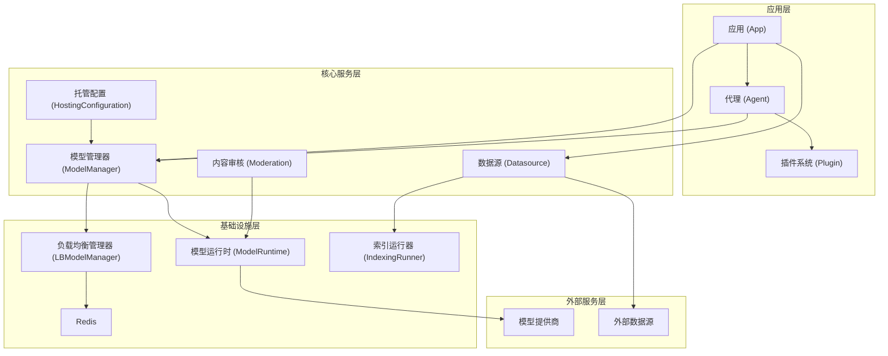
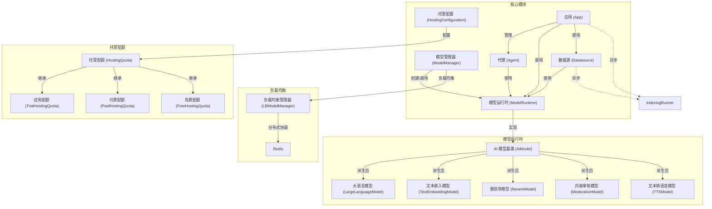
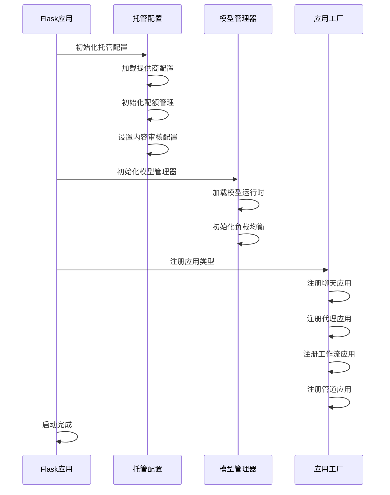
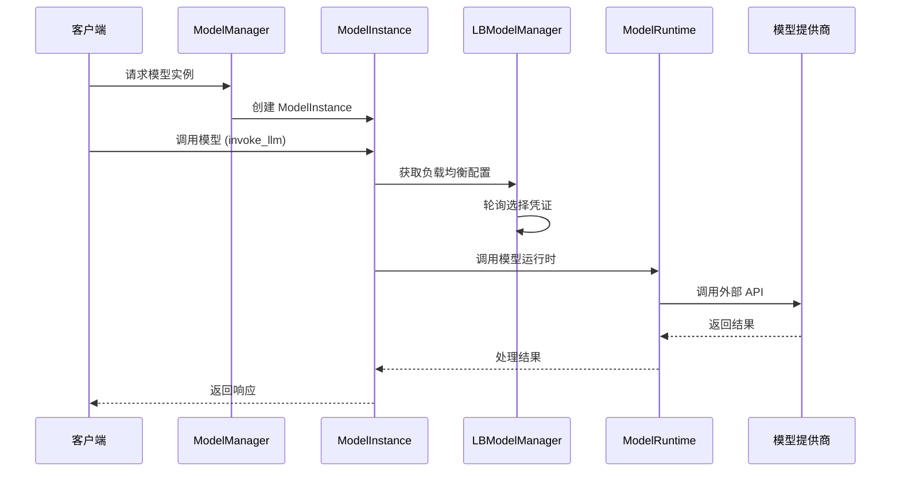
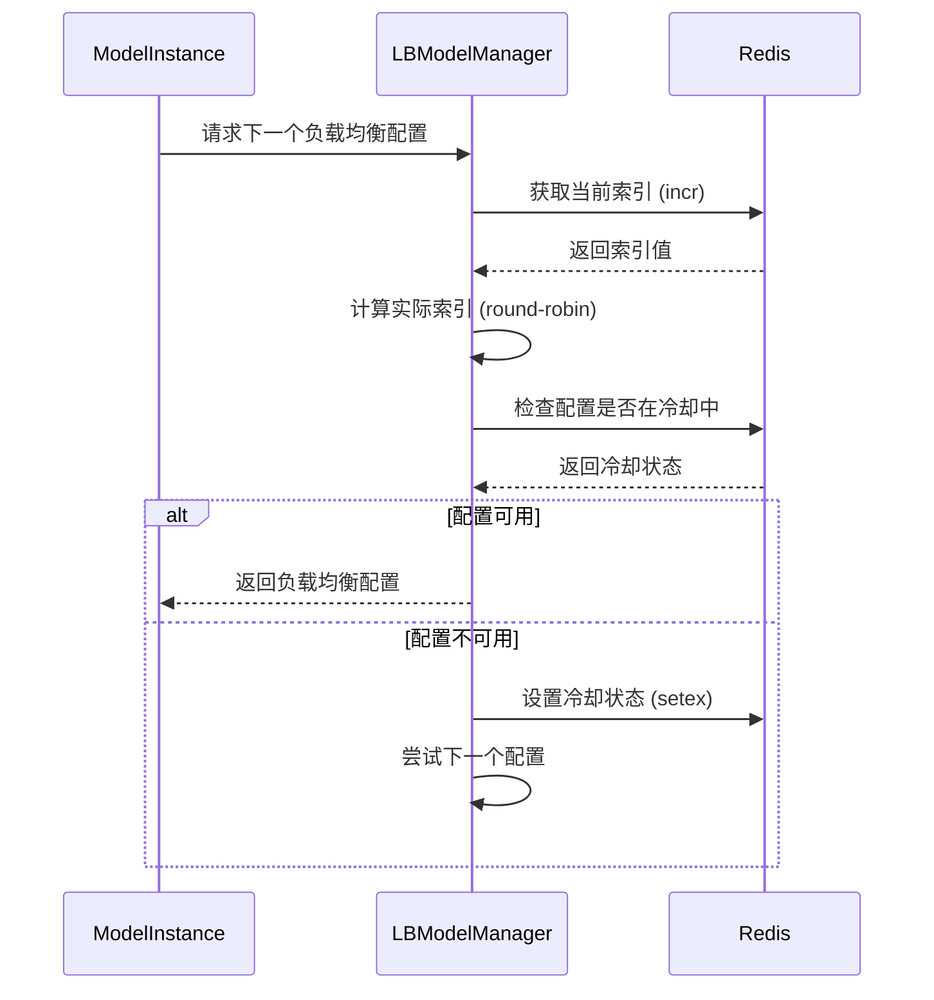
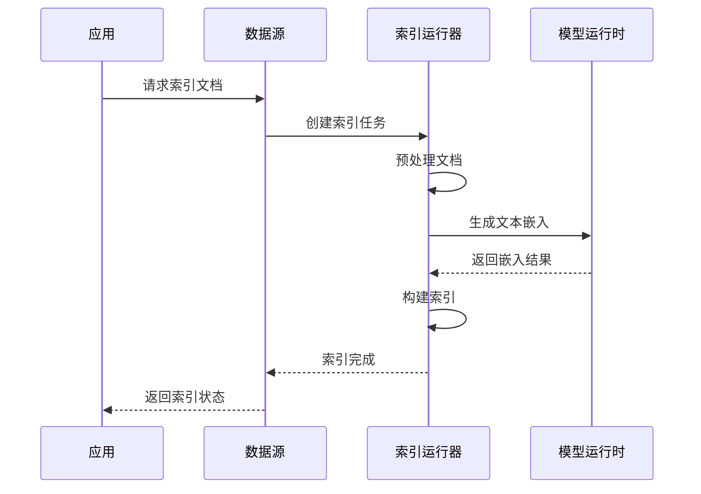

# api/core目录分析报告

## 1. 目录结构概览

`api/core` 目录是 Dify 系统的核心功能模块，包含了模型管理、托管配置、数据源处理、代理执行等关键功能。目录结构如下：

```
api/core/
├── agent/              # 代理执行相关功能
├── app/                # 应用程序级别的逻辑和配置
├── base/               # 基础组件
├── callback_handler/   # 回调处理器
├── datasource/         # 数据源处理
├── entities/           # 核心实体定义
├── errors/             # 错误处理
├── extension/          # 扩展功能
├── external_data_tool/ # 外部数据工具
├── file/               # 文件处理
├── helper/             # 通用工具函数
├── llm_generator/      # LLM 生成器
├── mcp/                # MCP 协议相关
├── memory/             # 内存管理
├── model_runtime/      # 模型运行时抽象层
├── moderation/         # 内容审核
├── ops/                # 运维相关
├── plugin/             # 插件系统
├── hosting_configuration.py # 托管配置
├── indexing_runner.py  # 索引运行器
└── model_manager.py    # 模型管理器
```

## 2. 核心组件架构图

### 2.1 分层架构视图



### 2.2 核心组件关系图



## 3. 核心组件详解

### 3.1 模型管理器 (ModelManager)

模型管理器是核心模块的入口点，负责管理模型实例的生命周期，包括创建、调用和销毁。

**主要功能：**
- 模型实例创建与管理
- 负载均衡调度
- 凭证轮换与管理
- 模型类型支持检查

**核心代码：**
```python
class ModelInstance:
    def __init__(self, provider_model_bundle: ProviderModelBundle, model: str):
        self.provider_model_bundle = provider_model_bundle
        self.model = model
        self.provider = provider_model_bundle.configuration.provider.provider
        self.credentials = self._fetch_credentials_from_bundle(provider_model_bundle, model)
        self.model_type_instance = self.provider_model_bundle.model_type_instance
        self.load_balancing_manager = self._get_load_balancing_manager(...)

    def invoke_llm(self, prompt_messages: Sequence[PromptMessage], ...) -> Union[LLMResult, Generator]:
        # LLM 调用逻辑
        pass
```

### 3.2 负载均衡管理器 (LBModelManager)

负责实现模型调用的负载均衡策略，使用 Redis 进行分布式协调。

**主要功能：**
- 轮询调度算法
- 冷却机制管理
- 凭证可用性检查
- 策略合规性验证

**核心代码：**
```python
class LBModelManager:
    def fetch_next(self) -> ModelLoadBalancingConfiguration | None:
        cache_key = "model_lb_index:{}:{}:{}:{}".format(
            self._tenant_id, self._provider, self._model_type.value, self._model
        )
        current_index = redis_client.incr(cache_key)
        # 轮询索引计算逻辑
        pass

    def cooldown(self, config: ModelLoadBalancingConfiguration, expire: int = 60):
        # 冷却机制实现
        pass
```

### 3.3 托管配置 (HostingConfiguration)

管理托管提供商的配置、配额设置和模型访问限制。

**主要功能：**
- 提供商配置管理
- 配额类型定义（试用/付费/免费）
- 模型访问限制
- 内容审核配置

**核心代码：**
```python
class HostingConfiguration:
    def init_app(self, app: Flask):
        if dify_config.EDITION != "CLOUD":
            return
        self.provider_map[f"{DEFAULT_PLUGIN_ID}/azure_openai/azure_openai"] = self.init_azure_openai()
        self.provider_map[f"{DEFAULT_PLUGIN_ID}/openai/openai"] = self.init_openai()
        # 其他提供商初始化
        self.moderation_config = self.init_moderation_config()
```

### 3.4 模型运行时 (ModelRuntime)

提供统一的模型接口抽象层，支持多种模型类型的调用。

**主要功能：**
- 统一模型接口
- 错误处理与转换
- 价格计算
- 模型架构缓存

**核心代码：**
```python
class AIModel(BaseModel):
    def get_price(self, model: str, credentials: dict, price_type: PriceType, tokens: int) -> PriceInfo:
        # 价格计算逻辑
        pass

    def get_model_schema(self, model: str, credentials: dict | None = None) -> AIModelEntity | None:
        # 模型架构获取与缓存
        pass
```

### 3.5 代理系统 (Agent)

代理系统负责处理复杂的任务执行和决策逻辑，支持多种代理策略。

**内部结构：**
```
agent/
├── output_parser/      # 输出解析器
├── prompt/             # 提示模板
├── strategy/           # 代理策略
├── base_agent_runner.py # 基础代理运行器
├── cot_agent_runner.py # 思维链代理运行器
├── cot_chat_agent_runner.py # 思维链聊天代理运行器
├── cot_completion_agent_runner.py # 思维链补全代理运行器
├── entities.py         # 代理实体定义
├── fc_agent_runner.py  # 函数调用代理运行器
└── plugin_entities.py  # 插件实体定义
```

**主要功能：**
- 多种代理策略支持（思维链、函数调用）
- 输出解析与处理
- 提示模板管理
- 工具调用与集成

**核心代码：**
```python
class BaseAgentRunner(AppRunner):
    def __init__(
        self,
        *, tenant_id: str, application_generate_entity: AgentChatAppGenerateEntity,
        conversation: Conversation, app_config: AgentChatAppConfig, model_config: ModelConfigWithCredentialsEntity,
        config: AgentEntity, queue_manager: AppQueueManager, message: Message,
        user_id: str, model_instance: ModelInstance, memory: TokenBufferMemory | None = None,
        prompt_messages: list[PromptMessage] | None = None,
    ):
        # 初始化代理运行器
        pass
```

### 3.6 应用系统 (App)

应用系统负责应用程序级别的逻辑和配置管理，支持多种应用类型。

**内部结构：**
```
app/
├── app_config/         # 应用配置
├── apps/               # 具体应用实现
├── entities/           # 应用实体定义
├── features/           # 应用功能特性
├── layers/             # 应用层
└── task_pipeline/      # 任务管道
```

**支持的应用类型：**
- Agent Chat（代理聊天）
- Advanced Chat（高级聊天）
- Chat（基础聊天）
- Completion（补全）
- Workflow（工作流）
- Pipeline（管道）

**主要功能：**
- 应用配置管理
- 应用类型支持
- 任务队列管理
- 响应生成与转换

### 3.7 数据源系统 (Datasource)

数据源系统负责数据的存储、检索和管理，支持多种数据源类型。

**内部结构：**
```
datasource/
├── __base/             # 数据源基础类
├── entities/           # 数据源实体定义
├── local_file/         # 本地文件数据源
├── online_document/    # 在线文档数据源
├── online_drive/       # 在线驱动器数据源
├── utils/              # 数据源工具
├── website_crawl/      # 网站爬取数据源
├── datasource_file_manager.py # 数据源文件管理器
├── datasource_manager.py # 数据源管理器
└── errors.py           # 数据源错误定义
```

**主要功能：**
- 数据源插件系统
- 文件上传与处理
- 文档索引与检索
- 外部数据源集成

## 4. 核心工作流程

### 4.1 应用启动流程



### 4.2 模型调用流程



### 4.3 负载均衡流程



### 4.4 数据索引流程



## 5. 技术特点与优势

### 5.1 模型管理
- **统一抽象层**：通过 AIModel 基类为所有模型提供统一接口
- **多模型类型支持**：支持 LLM、文本嵌入、重排序、内容审核、TTS 等多种模型类型
- **动态负载均衡**：基于 Redis 的轮询策略实现凭证轮换和负载均衡
- **冷却机制**：自动处理速率限制，提高系统可用性

### 5.2 托管配置
- **灵活配额管理**：支持试用、付费、免费三种配额类型
- **模型访问控制**：基于 RestrictModel 实现细粒度的模型访问限制
- **提供商隔离**：每个提供商独立配置，便于扩展和维护
- **内容审核集成**：内置内容审核配置，支持多种审核提供商

### 5.3 架构设计
- **模块化设计**：各组件职责明确，便于扩展和维护
- **分布式协调**：使用 Redis 实现跨实例的状态同步
- **租户隔离**：支持多租户环境下的资源隔离和配置管理
- **插件化架构**：数据源、模型提供商等支持插件扩展

### 5.4 性能优化
- **模型架构缓存**：减少重复请求，提高性能
- **连接池管理**：优化网络连接，减少资源消耗
- **异步处理**：支持流式响应，提高用户体验
- **错误重试机制**：自动处理临时错误，提高系统稳定性

## 6. 架构决策分析

### 6.1 为什么选择 Redis 作为分布式协调工具？

**决策依据：**
- **高性能**：Redis 提供低延迟的键值存储和原子操作，适合高并发场景
- **分布式锁**：支持 SETNX 等命令实现分布式锁
- **计数器功能**：INCR 命令可用于实现分布式计数器，适合负载均衡索引
- **过期时间**：SETEX 命令可用于实现冷却机制
- **广泛应用**：社区成熟，部署和维护成本低

**替代方案考虑：**
- **ZooKeeper**：更适合复杂的分布式协调，但性能开销较大
- **Etcd**：API 友好，但在高并发场景下性能不如 Redis

### 6.2 模型运行时抽象层的设计依据

**决策依据：**
- **统一接口**：为不同类型的模型提供一致的调用方式，降低上层代码复杂度
- **可扩展性**：便于添加新的模型类型和提供商
- **错误统一处理**：集中处理模型调用错误，提供一致的错误信息
- **性能优化**：统一实现缓存、连接池等性能优化措施

### 6.3 负载均衡策略的选择原因

**决策依据：**
- **简单高效**：轮询策略实现简单，性能开销小
- **公平性**：确保所有凭证都能被均匀使用
- **易于实现分布式**：基于 Redis 计数器即可实现
- **可扩展性**：可在此基础上扩展更复杂的负载均衡策略

**替代方案考虑：**
- **权重轮询**：可根据凭证性能设置权重，但增加了复杂度
- **最小连接数**：更适合长连接场景，不适合 API 调用场景

## 7. 架构质量属性评估

### 7.1 可扩展性

**评估：**
- **模型扩展性**：通过 AIModel 基类可轻松添加新模型类型
- **提供商扩展性**：支持插件化的提供商扩展
- **应用扩展性**：支持多种应用类型，可通过 AppFactory 注册新应用
- **数据源扩展性**：支持插件化的数据源扩展

**改进建议：**
- 增加更完善的插件注册和发现机制
- 提供更详细的扩展开发文档

### 7.2 可靠性

**评估：**
- **错误处理**：统一的错误处理机制
- **重试机制**：内置临时错误重试逻辑
- **冷却机制**：自动处理速率限制
- **负载均衡**：提高系统整体可用性

**改进建议：**
- 增加更完善的监控和告警机制
- 实现更智能的故障转移策略

### 7.3 性能

**评估：**
- **缓存机制**：模型架构缓存减少重复请求
- **异步处理**：支持流式响应，提高用户体验
- **连接池**：优化网络连接，减少资源消耗
- **负载均衡**：提高系统整体吞吐量

**改进建议：**
- 实现更高效的缓存策略（如 LRU 缓存）
- 增加请求合并和批处理机制

### 7.4 安全性

**评估：**
- **凭证管理**：安全的凭证存储和传输
- **访问控制**：细粒度的模型访问限制
- **内容审核**：内置内容审核机制
- **租户隔离**：多租户环境下的资源隔离

**改进建议：**
- 增加更严格的凭证加密存储
- 实现更完善的审计日志

## 8. 代码优化建议

### 8.1 模型运行时优化

**问题：** 当前模型架构缓存使用本地内存，在分布式环境下可能不一致

**解决方案：** 实现分布式缓存策略

```python
# 优化前
def get_model_schema(self, model: str, credentials: dict | None = None) -> AIModelEntity | None:
    cache_key = f"model_schema:{self.provider}:{model}"
    if cache_key in self._model_schema_cache:
        return self._model_schema_cache[cache_key]
    # 获取模型架构并缓存
    pass

# 优化后
def get_model_schema(self, model: str, credentials: dict | None = None) -> AIModelEntity | None:
    cache_key = f"model_schema:{self.provider}:{model}"
    # 尝试从分布式缓存获取
    cached_schema = redis_client.get(cache_key)
    if cached_schema:
        return AIModelEntity(**json.loads(cached_schema))
    
    # 获取模型架构
    schema = self._fetch_model_schema(model, credentials)
    
    # 保存到分布式缓存
    redis_client.setex(cache_key, 3600, json.dumps(schema.model_dump()))
    return schema
```

**优先级：** 高

### 8.2 负载均衡优化

**问题：** 当前轮询策略不考虑凭证的实际性能和可用性

**解决方案：** 实现基于性能的权重轮询策略

```python
class WeightedLBModelManager(LBModelManager):
    def fetch_next(self) -> ModelLoadBalancingConfiguration | None:
        # 获取所有可用配置及其权重
        available_configs = [config for config in self._load_balancing_configs if self._is_available(config)]
        
        if not available_configs:
            return None
            
        # 计算总权重
        total_weight = sum(config.weight for config in available_configs)
        
        # 获取当前索引
        cache_key = f"model_lb_index:{self._tenant_id}:{self._provider}:{self._model_type.value}:{self._model}"
        current_index = redis_client.incr(cache_key)
        
        # 根据权重选择配置
        target = current_index % total_weight
        current_weight = 0
        
        for config in available_configs:
            current_weight += config.weight
            if target < current_weight:
                return config
                
        return available_configs[0]
```

**优先级：** 中

### 8.3 代理系统优化

**问题：** 当前代理运行器初始化过程复杂，参数过多

**解决方案：** 使用建造者模式简化初始化

```python
class AgentRunnerBuilder:
    def __init__(self):
        self.config = {}
        
    def with_tenant_id(self, tenant_id: str) -> "AgentRunnerBuilder":
        self.config["tenant_id"] = tenant_id
        return self
        
    def with_model_instance(self, model_instance: ModelInstance) -> "AgentRunnerBuilder":
        self.config["model_instance"] = model_instance
        return self
        
    # 其他配置方法
    
    def build(self) -> BaseAgentRunner:
        return BaseAgentRunner(**self.config)

# 使用示例
gen = AgentRunnerBuilder()
agent_runner = gen.with_tenant_id(tenant_id).with_model_instance(model_instance).build()
```

**优先级：** 中

### 8.4 应用系统优化

**问题：** 当前应用类型注册方式不够灵活

**解决方案：** 实现基于装饰器的应用注册机制

```python
class AppRegistry:
    _registry = {}
    
    @classmethod
    def register(cls, app_type: str):
        def decorator(app_class):
            cls._registry[app_type] = app_class
            return app_class
        return decorator
    
    @classmethod
    def get_app_class(cls, app_type: str):
        return cls._registry.get(app_type)

# 使用示例
@AppRegistry.register("agent_chat")
class AgentChatAppRunner(AppRunner):
    # 应用实现
    pass
```

**优先级：** 低

## 9. 最佳实践与架构监控

### 9.1 开发最佳实践

1. **组件设计原则**：
   - 单一职责原则：每个组件只负责一个功能领域
   - 依赖倒置原则：依赖于抽象而不是具体实现
   - 接口隔离原则：提供最小化的接口

2. **性能优化建议**：
   - 合理使用缓存，避免重复计算
   - 优先使用异步处理，提高系统吞吐量
   - 优化数据库查询，减少不必要的查询

3. **错误处理建议**：
   - 使用统一的错误处理机制
   - 提供详细的错误信息和错误码
   - 实现适当的重试机制

### 9.2 架构监控建议

1. **关键指标监控**：
   - 模型调用成功率和延迟
   - 负载均衡配置使用率
   - 应用响应时间和吞吐量
   - 数据源索引和检索性能

2. **日志记录建议**：
   - 记录关键业务流程日志
   - 记录错误和异常日志
   - 记录性能指标日志

3. **告警配置建议**：
   - 模型调用失败率超过阈值时告警
   - 系统响应时间超过阈值时告警
   - 资源使用率超过阈值时告警

## 10. 总结

api/core 目录是 Dify 系统的核心功能模块，提供了模型管理、托管配置、数据源处理等关键功能。其设计具有以下特点：

1. **高度模块化**：各组件职责明确，便于扩展和维护
2. **统一抽象层**：为不同类型的模型提供统一的接口
3. **灵活的配置管理**：支持多种配额类型和模型访问限制
4. **高性能设计**：通过缓存、连接池等机制优化性能
5. **高可用性**：内置负载均衡、冷却机制和错误重试

通过持续的架构优化和监控，可以确保 Dify 系统的核心模块始终保持高性能、高可用性和可扩展性，为用户提供稳定可靠的服务。