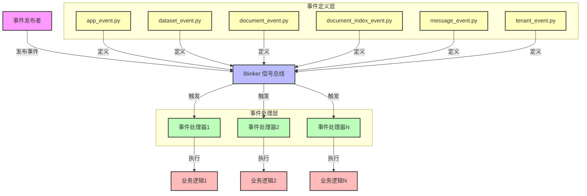

# api/events目录分析报告

## 1. 模块概述

API Events 模块是 Dify 系统的事件驱动核心，基于 Blinker 信号库实现，提供了松耦合的事件发布-订阅机制。该模块负责定义系统中各类关键事件，并协调事件处理器执行相应的业务逻辑，实现了系统各组件之间的解耦和异步协作。

## 2. 目录结构

```
api/events/
├── event_handlers/         # 事件处理器目录
│   ├── __init__.py         # 处理器导入和注册
│   ├── clean_when_dataset_deleted.py             # 数据集删除时的清理处理
│   ├── clean_when_document_deleted.py            # 文档删除时的清理处理
│   ├── create_document_index.py                  # 创建文档索引
│   ├── create_installed_app_when_app_created.py  # 应用创建时创建安装记录
│   ├── create_site_record_when_app_created.py    # 应用创建时创建站点记录
│   ├── delete_tool_parameters_cache_when_sync_draft_workflow.py  # 同步草稿工作流时删除工具参数缓存
│   ├── sync_plugin_trigger_when_app_created.py   # 应用创建时同步插件触发器
│   ├── sync_webhook_when_app_created.py          # 应用创建时同步 Webhook
│   ├── sync_workflow_schedule_when_app_published.py  # 应用发布时同步工作流调度
│   ├── update_app_dataset_join_when_app_model_config_updated.py  # 应用模型配置更新时更新数据集关联
│   ├── update_app_dataset_join_when_app_published_workflow_updated.py  # 应用发布工作流更新时更新数据集关联
│   ├── update_app_triggers_when_app_published_workflow_updated.py  # 应用发布工作流更新时更新触发器
│   └── update_provider_when_message_created.py   # 消息创建时更新提供商信息
├── __init__.py             # 空文件，模块标记
├── app_event.py            # 应用相关事件定义
├── dataset_event.py        # 数据集相关事件定义
├── document_event.py       # 文档相关事件定义
├── document_index_event.py # 文档索引相关事件定义
├── message_event.py        # 消息相关事件定义
└── tenant_event.py         # 租户相关事件定义
```

## 3. 系统架构与数据流

### 3.1 架构图



### 3.2 核心组件关系

1. **事件发布者**：系统中任何产生事件的组件，如API控制器、服务层等
2. **Blinker 信号总线**：事件分发的核心，负责管理事件订阅和通知
3. **事件定义**：集中定义系统中的各类事件，每个事件对应一个Blinker信号
4. **事件处理器**：订阅特定事件并执行相应业务逻辑的函数
5. **业务逻辑**：事件处理器调用的具体业务操作

### 3.3 数据流向

1. 事件发布者在特定业务操作完成后，调用相应事件的发送方法
2. Blinker信号总线接收到事件后，通知所有订阅该事件的处理器
3. 事件处理器依次执行，接收事件参数并执行业务逻辑
4. 业务逻辑可能涉及数据库操作、缓存更新、外部系统调用等

### 3.4 事件生命周期

事件在系统中的完整生命周期包括以下阶段：

1. **事件定义**：
   - 在事件定义文件中使用`signal()`方法创建事件
   - 定义事件名称、发送者类型和预期参数
   - 示例：`app_was_created = signal("app-was-created")`

2. **事件订阅**：
   - 事件处理器通过`@event_name.connect`装饰器订阅事件
   - 系统启动时自动扫描并注册所有处理器
   - 示例：`@app_was_created.connect
def handle_app_created(sender, **kwargs):`

3. **事件触发**：
   - 业务代码在适当的时机调用`event_name.send()`方法
   - 通常在数据库事务提交后或操作完成后触发
   - 示例：`app_was_created.send(app, account=current_account)`

4. **事件分发**：
   - Blinker信号总线接收事件并查找所有订阅该事件的处理器
   - 按照处理器注册的顺序依次调用
   - 支持多处理器并行处理（Blinker默认同步调用）

5. **事件处理**：
   - 每个处理器接收事件发送者和额外参数
   - 执行相应的业务逻辑（如发送通知、更新关联数据等）
   - 单个处理器的失败不会影响其他处理器的执行

6. **事件完成**：
   - 所有处理器执行完毕后，事件生命周期结束
   - 事件处理结果不影响原始业务流程
   - 处理器应自行处理异常并记录日志

## 4. 核心功能模块

### 4.1 事件定义模块

事件定义模块负责集中管理系统中的所有事件，每个事件对应一个Blinker信号。事件定义遵循统一的命名规范，清晰地描述了事件的触发时机和携带的参数。

**关键事件列表：**

| 事件文件 | 事件名称 | 触发时机 | 参数说明 |
|---------|---------|---------|---------|
| app_event.py | app_was_created | 应用创建完成 | sender: app |
| app_event.py | app_model_config_was_updated | 应用模型配置更新 | sender: app, kwargs: app_model_config |
| app_event.py | app_published_workflow_was_updated | 应用发布工作流更新 | sender: app, kwargs: published_workflow |
| app_event.py | app_draft_workflow_was_synced | 应用草稿工作流同步 | sender: app, kwargs: synced_draft_workflow |
| dataset_event.py | dataset_was_deleted | 数据集删除完成 | sender: dataset |
| document_event.py | document_was_deleted | 文档删除完成 | sender: document |
| document_index_event.py | document_index_created | 文档索引创建 | sender: document |
| message_event.py | message_was_created | 消息创建完成 | sender: message, kwargs: conversation |
| tenant_event.py | tenant_was_created | 租户创建完成 | sender: tenant |
| tenant_event.py | tenant_was_updated | 租户信息更新 | sender: tenant |

### 4.2 事件处理器模块

事件处理器模块包含了所有订阅和处理事件的函数，每个处理器负责执行特定事件的副作用操作。处理器通过装饰器`@event_name.connect`与事件关联，实现了松耦合的设计。

**核心处理器分析：**

1. **文档索引创建处理器** (`create_document_index.py`)
   - 订阅：`document_index_created`事件
   - 功能：触发文档解析和索引构建过程
   - 技术特点：使用IndexingRunner异步处理文档索引，支持错误重试和状态管理

2. **提供商更新处理器** (`update_provider_when_message_created.py`)
   - 订阅：`message_was_created`事件
   - 功能：更新提供商使用统计和配额信息
   - 技术特点：
     - 合并了原有的两个处理器功能，提高效率
     - 使用Redis缓存优化频繁更新操作
     - 实现了时间窗口优化，减少数据库写操作
     - 支持多种配额单位（Tokens、Credits、Times）

3. **应用创建相关处理器**
   - `create_installed_app_when_app_created.py`：创建应用安装记录
   - `create_site_record_when_app_created.py`：创建应用站点记录
   - `sync_plugin_trigger_when_app_created.py`：同步应用插件触发器
   - `sync_webhook_when_app_created.py`：同步应用Webhook配置
   - 特点：通过多个独立处理器实现单一事件的多维度处理，提高系统可维护性

### 4.3 事件发布者分析

事件发布者是系统中产生和发布事件的组件，主要分布在服务层和命令行工具中：

#### 4.3.1 主要事件发布者

| 组件类型 | 位置 | 发布的主要事件 |
|---------|-----|---------------|
| 应用服务 | `api/services/app_service.py` | `app_was_created` |
| 应用DSL服务 | `api/services/app_dsl_service.py` | `app_was_created` |
| 工作流转换服务 | `api/services/workflow/workflow_converter.py` | `app_was_created` |
| 数据集服务 | `api/services/dataset_service.py` | `dataset_was_deleted` |
| 文档服务 | `api/services/document_service.py` | `document_was_deleted` |
| 消息服务 | `api/services/message_service.py` | `message_was_created` |
| 命令行工具 | `api/commands.py` | 多种维护类事件 |

#### 4.3.2 事件发布模式

1. **服务层发布**：
   ```python
   # 在app_service.py中发布应用创建事件
   def create_app(self, name, tenant_id, creator_id):
       app = App(name=name, tenant_id=tenant_id, creator_id=creator_id)
       db.session.add(app)
       db.session.commit()
       app_was_created.send(app, account=current_account)
       return app
   ```

2. **批量操作发布**：
   ```python
   # 批量处理完成后发布多个事件
   for document in documents:
       db.session.delete(document)
   db.session.commit()
   
   # 为每个删除的文档发布事件
   for document in documents:
       document_was_deleted.send(document)
   ```

#### 4.3.3 发布者特点

- **集中在服务层**：事件发布主要在服务层进行，遵循领域驱动设计原则
- **事务后发布**：所有事件都在数据库事务提交后发布，确保数据一致性
- **上下文丰富**：事件携带足够的上下文信息，便于处理器做出正确决策
- **松耦合**：发布者不依赖于具体的处理器实现

### 4.4 性能优化机制

事件系统实现了多种性能优化机制，确保在高负载下的稳定运行：

1. **Redis缓存优化**：
   - 对频繁更新的字段（如提供商最后使用时间）使用Redis缓存
   - 设置合理的缓存过期时间（默认10分钟）
   - 实现时间窗口更新策略，减少数据库写操作

2. **批量更新机制**：
   - 将多个相关更新操作合并到单个事务中执行
   - 减少数据库连接开销和锁竞争

3. **异步处理支持**：
   - 部分耗时操作使用异步处理模式
   - 避免阻塞主业务流程

4. **错误隔离机制**：
   - 单个事件处理器的失败不会影响其他处理器
   - 完善的日志记录，便于问题排查

## 5. 技术实现细节

### 5.1 事件定义模式

```python
from blinker import signal

# sender: app
app_was_created = signal("app-was-created")
```

- 使用`blinker.signal`创建事件信号
- 遵循统一的命名规范：`resource-action-past-tense`
- 明确标注事件发送者类型和参数信息

### 5.2 事件处理器注册

```python
from events.message_event import message_was_created

@message_was_created.connect
def handle(sender: Message, **kwargs):
    # 事件处理逻辑
```

- 使用装饰器`@event_name.connect`注册处理器
- 支持类型注解，提高代码可读性
- 接收事件发送者和额外参数

### 5.3 事件发布示例

在实际业务代码中，发布事件通常在业务操作完成后进行：

```python
from events.app_event import app_was_created

# 创建应用实例
app = App(
    name="My Application",
    tenant_id=current_tenant_id,
    creator_id=current_user_id
)

# 保存到数据库
db.session.add(app)
db.session.commit()

# 发布应用创建事件，携带额外参数
app_was_created.send(app, account=current_account)
```

- 使用`event_name.send()`方法发布事件
- 第一个参数为事件发送者（通常是操作的主要对象）
- 可以通过关键字参数传递额外的上下文信息
- 事件发布应在数据库事务提交后进行，确保数据一致性

### 5.4 Redis缓存优化实现

```python
@redis_fallback(default_return=None)
def _get_last_update_timestamp(cache_key: str) -> datetime | None:
    """Get last update timestamp from Redis cache."""
    timestamp_str = redis_client.get(cache_key)
    if timestamp_str:
        return datetime.fromtimestamp(float(timestamp_str.decode("utf-8")))
    return None

@redis_fallback()
def _set_last_update_timestamp(cache_key: str, timestamp: datetime):
    """Set last update timestamp in Redis cache with TTL."""
    redis_client.setex(cache_key, _CACHE_TTL_SECONDS, str(timestamp.timestamp()))
```

- 使用`redis_fallback`装饰器实现Redis操作的降级策略
- 为缓存项设置合理的TTL，避免缓存过期导致的数据不一致
- 提供默认返回值，确保Redis不可用时系统仍能正常运行

## 6. 系统集成与依赖

### 6.1 核心依赖

| 依赖库 | 版本要求 | 用途 |
|-------|---------|------|
| blinker | ^1.4 | 事件驱动框架 |
| redis | ^4.5.4 | 缓存优化 |
| sqlalchemy | ^2.0.23 | 数据库操作 |

### 6.2 与其他模块的集成

1. **与API控制器的集成**：
   - 控制器在业务操作完成后发布事件
   - 实现了业务逻辑与副作用操作的解耦

2. **与数据模型的集成**：
   - 事件处理器频繁操作数据模型
   - 使用SQLAlchemy进行数据库操作

3. **与缓存系统的集成**：
   - 使用Redis缓存优化性能
   - 实现了缓存与数据库的一致性维护

4. **与外部系统的集成**：
   - 部分事件处理器涉及外部系统调用（如Webhook）
   - 实现了错误重试和异常处理机制

## 7. 监控与维护

### 7.1 日志记录

事件系统实现了完善的日志记录机制：

```python
logger = logging.getLogger(__name__)

logger.info("Provider updates completed successfully. Updates: %s, Duration: %s s, Tenant: %s, Provider: %s",
            len(updates_to_perform),
            duration,
            tenant_id,
            provider_name,
)
```

- 记录事件处理的关键步骤和性能指标
- 提供详细的错误信息，便于问题排查
- 支持不同级别的日志输出（DEBUG、INFO、WARNING、ERROR）

### 7.2 常见问题与解决方案

| 问题 | 解决方案 |
|-----|---------|
| 事件处理器执行失败 | 检查日志信息，排查具体错误原因；考虑添加重试机制 |
| 事件处理性能瓶颈 | 分析耗时操作，考虑异步处理；优化数据库查询；增加缓存层 |
| 事件顺序问题 | 确保关键业务逻辑在事件发布前完成；使用事务确保数据一致性 |
| 内存泄漏 | 确保事件处理器正确清理资源；避免循环引用 |

## 8. 开发最佳实践

### 8.1 事件命名规范

- **命名格式**：采用`resource-action-past-tense`格式（如`app-was-created`）
- **明确性**：事件名称应清晰描述发生的动作和时机
- **一致性**：相同类型的事件使用相似的命名模式
- **避免歧义**：避免使用模糊或容易误解的术语

### 8.2 事件定义最佳实践

- **集中管理**：所有事件应在事件定义文件中集中定义
- **文档化**：为每个事件添加注释，说明触发时机、发送者类型和参数
- **参数设计**：
  - 第一个参数应为主要对象（sender）
  - 使用关键字参数传递额外上下文
  - 避免传递过大或复杂的对象
- **版本控制**：为事件添加版本号，以便在不兼容变更时进行管理

### 8.3 事件处理最佳实践

- **单一职责**：每个处理器应只处理一个明确的职责
- **幂等性**：处理器应设计为幂等的，避免重复处理导致副作用
- **错误隔离**：处理器内部应包含错误处理逻辑，避免影响其他处理器
- **性能考虑**：
  - 避免在处理器中执行长时间运行的操作
  - 考虑使用异步处理或队列处理耗时任务
  - 对频繁调用的处理器进行性能优化
- **事务管理**：处理器内部应使用独立的数据库事务

### 8.4 事件发布最佳实践

- **时机选择**：在业务操作完成并提交数据库事务后发布事件
- **上下文完整性**：确保事件包含足够的上下文信息
- **避免过度发布**：只在需要通知其他组件时发布事件
- **事件溯源考虑**：如果需要追踪系统状态变化，考虑记录所有事件

### 8.5 测试建议

- **单元测试**：为事件处理器编写单元测试，模拟事件发布
- **集成测试**：测试完整的事件流，包括发布和处理
- **性能测试**：评估事件系统在高负载下的性能
- **故障测试**：测试处理器失败时的系统行为

## 9. 架构评估与优化建议

### 8.1 架构优势

1. **松耦合设计**：事件发布者与处理器解耦，提高系统可扩展性
2. **可维护性强**：事件定义集中管理，处理器职责单一
3. **可测试性好**：事件处理器可以独立测试，不受业务流程影响
4. **扩展性高**：新增事件或处理器无需修改现有代码
5. **性能优化**：实现了多种性能优化机制，支持高负载场景

### 8.2 优化建议

1. **事件溯源支持**：
   - 考虑添加事件溯源功能，记录所有事件的完整历史
   - 便于系统状态重建和审计

2. **事件优先级机制**：
   - 为不同事件添加优先级标记
   - 实现优先级队列，确保重要事件优先处理

3. **异步事件总线**：
   - 考虑引入消息队列（如RabbitMQ、Kafka）作为事件总线
   - 提高系统的异步处理能力和可靠性

4. **事件监控面板**：
   - 开发事件监控面板，实时查看事件处理情况
   - 支持事件统计、延迟分析和错误告警

5. **批量事件处理**：
   - 实现批量事件发布和处理机制
   - 减少频繁事件处理的性能开销

## 9. 总结

API Events 模块是 Dify 系统的事件驱动核心，通过 Blinker 信号库实现了高效的松耦合事件发布-订阅机制。该模块定义了系统中各类关键事件，并协调事件处理器执行相应的业务逻辑，实现了系统各组件之间的解耦和异步协作。

事件系统采用了分层设计，包括事件定义层、事件处理层和业务逻辑层，各层之间职责明确，接口清晰。系统实现了多种性能优化机制，包括 Redis 缓存、批量更新、异步处理等，确保在高负载下的稳定运行。

通过事件驱动架构，Dify 系统提高了可扩展性、可维护性和可测试性，为未来的功能扩展和性能优化奠定了坚实基础。