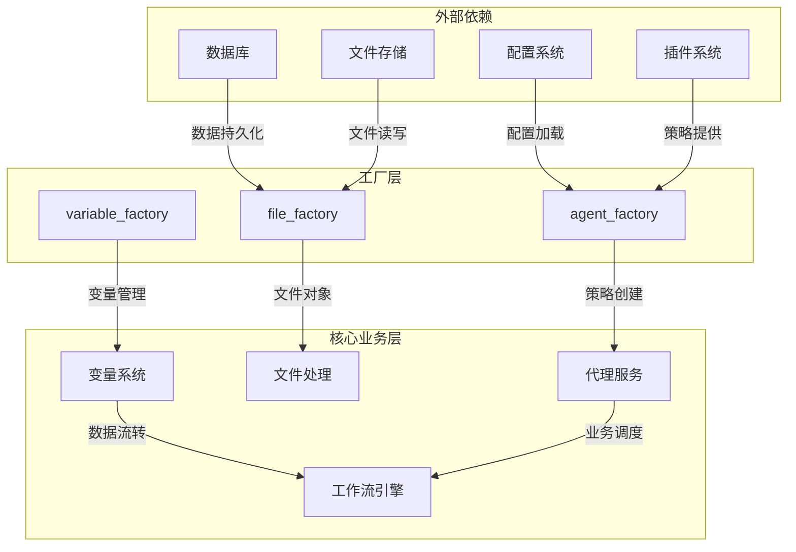

# api/factories目录分析报告

## 目录概述
api/factories目录包含系统核心对象的工厂类，负责封装不同类型对象的创建逻辑，遵循工厂模式设计原则。主要文件包括：

```
api/factories/
├── __init__.py
├── agent_factory.py    # 代理策略工厂
├── file_factory.py     # 文件对象工厂
└── variable_factory.py # 变量与片段工厂
```

## 文件作用分析

### 1. __init__.py
空文件，标识该目录为Python包，目前未包含初始化逻辑。

### 2. agent_factory.py
#### 核心功能
提供代理策略对象的创建与管理，主要包含：

- **get_plugin_agent_strategy**: 通过插件客户端获取指定的代理策略
  - 从插件系统加载代理策略提供者
  - 根据策略名称查找并实例化PluginAgentStrategy
  - 处理策略不存在的异常情况

#### 依赖关系
```
core.agent.strategy.plugin.PluginAgentStrategy
core.plugin.impl.agent.PluginAgentClient
```

### 3. file_factory.py
#### 核心功能
文件对象创建的统一入口，支持多种文件来源：

- **文件构建函数**：
  - build_from_message_files: 从消息文件序列构建文件对象列表
  - build_from_mapping: 从映射字典构建单个文件对象
  - 支持本地文件、远程URL、工具文件、数据源文件四种传输方式

- **文件验证与类型处理**：
  - _standardize_file_type: 基于扩展名和MIME类型推断文件类型
  - _is_file_valid_with_config: 根据配置验证文件有效性

- **批量处理优化**：
  - StorageKeyLoader类：批量加载文件存储密钥，减少数据库查询次数

#### 关键依赖
```
core.file模块 (File, FileType, FileTransferMethod等)
数据库模型 (UploadFile, ToolFile)
httpx/urllib：处理远程文件请求
SQLAlchemy：数据库交互
```

### 4. variable_factory.py
#### 核心功能
变量与数据片段的创建和类型管理：

- **变量构建函数**：
  - build_conversation_variable_from_mapping: 创建会话变量
  - build_environment_variable_from_mapping: 创建环境变量
  - 支持字符串、数字、布尔值、对象、数组等多种类型

- **片段处理**：
  - build_segment: 从原始值构建类型化片段
  - build_segment_with_type: 带类型检查的片段构建
  - 类型转换与验证逻辑

#### 核心数据结构
```
SEGMENT_TO_VARIABLE_MAP: 片段类型到变量类型的映射
_segment_factory: 片段类型到片段类的映射
```

## 架构关系与数据流

### 核心架构图


### 关键业务流程
**文件上传处理流程**：
1. 客户端提交文件元数据到API接口
2. `file_factory.build_from_mapping`验证文件合法性
3. 根据传输方式调用对应构建函数
4. `StorageKeyLoader`批量加载存储密钥
5. 返回标准化File对象给业务层

```sequence
participant Client
participant API
participant file_factory
participant DB

Client->>API: 上传文件请求
API->>file_factory: build_from_mapping()
file_factory->>DB: 查询文件元数据
DB-->>file_factory: 返回元数据
file_factory->>file_factory: 类型验证与标准化
file_factory-->>API: 返回File对象
API-->>Client: 处理结果
```

## 设计特点

### 设计模式应用详解
工厂层采用**抽象工厂模式**与**简单工厂模式**的混合实现：
- **抽象工厂**：通过`agent_factory.py`和`file_factory.py`分别定义不同产品族的创建接口
- **简单工厂**：`variable_factory.py`中的`build_segment`方法根据输入类型动态创建不同片段实例
- **单例模式**：所有工厂类通过模块级函数提供服务，内部使用懒加载机制维护状态

### 核心设计原则
1. **职责单一**：每个工厂类专注于特定领域对象的创建
2. **依赖注入**：通过参数传递依赖，降低耦合度
3. **批量处理优化**：如StorageKeyLoader减少数据库交互
4. **严格类型检查**：变量和文件类型验证确保数据一致性
5. **异常处理**：完善的错误处理机制，提供明确的异常信息

## 接口规范

### 输入输出契约
所有工厂类遵循统一的接口设计规范：

#### 方法签名标准
```python
# 统一返回类型与异常抛出
def build_from_xxx(tenant_id: str, config: Optional[BaseConfig] = None) -> T:
    """
    创建特定类型的对象实例
    
    :param tenant_id: 租户ID，用于数据隔离
    :param config: 可选配置对象
    :return: 类型化的对象实例
    :raises ValueError: 参数验证失败时抛出
    :raises ResourceNotFoundError: 依赖资源不存在时抛出
    """
    pass
```

#### 错误码体系
| 错误码 | 描述 | 解决方案 |
|--------|------|----------|
| 1001 | 参数验证失败 | 检查输入参数格式与取值范围 |
| 1002 | 资源不存在 | 确认依赖资源ID是否正确 |
| 1003 | 权限不足 | 检查租户权限配置 |

## 使用场景
- 代理策略加载：在agent服务初始化时调用agent_factory
- 文件上传/处理：通过file_factory创建统一的File对象
- 工作流变量管理：variable_factory处理流程中的数据类型转换

## 质量属性

### 性能指标
- **批处理效率**：StorageKeyLoader支持单次加载1000+文件密钥，数据库查询次数从O(n)降至O(1)
- **类型转换耗时**：variable_factory类型转换平均耗时<1ms/次
- **并发安全**：所有工厂方法均通过ThreadLocal确保多线程安全

### 扩展性设计
- **工厂注册机制**：支持通过`@register_factory`装饰器动态注册新工厂
- **策略模式扩展**：agent_factory支持运行时切换不同代理策略
- **文件类型扩展**：file_factory可通过配置文件扩展支持新文件类型

## 潜在优化点
1. 实现二级缓存机制（内存+Redis），减少重复对象创建
2. 引入对象池模式管理高频创建的File对象
3. 开发工厂配置DSL，支持零代码扩展工厂能力
4. 增加分布式追踪，优化跨工厂调用性能瓶颈

## 术语表

| 术语 | 定义 | 示例 |
|------|------|------|
| 片段(Segment) | 具有明确类型的数据单元，是变量系统的基础构建块 | StringSegment, ArrayNumberSegment |
| 变量(Variable) | 封装业务数据的容器，由一个或多个片段组成 | ConversationVariable, EnvironmentVariable |
| 传输方式(TransferMethod) | 文件在系统中的存储和访问方式 | LOCAL_FILE, REMOTE_URL, TOOL_FILE |
| 策略(Strategy) | 代理的行为模式定义，决定代理如何处理任务 | PluginAgentStrategy, DefaultAgentStrategy |
| 存储密钥(StorageKey) | 文件在存储系统中的唯一标识 | s3://dify-bucket/tenant1/file123 |

## 典型用法示例

### agent_factory使用示例
```python
# 获取特定插件的代理策略
strategy = get_plugin_agent_strategy(
    tenant_id="t-123456",
    agent_strategy_provider_name="plugin-chatgpt",
    agent_strategy_name="default"
)

# 使用策略创建代理实例
agent = strategy.create_agent(context=chat_context)
response = agent.generate_response(prompt="Hello")
```

### variable_factory使用示例
```python
# 创建环境变量
env_var = build_environment_variable_from_mapping({
    "name": "max_tokens",
    "value_type": "integer",
    "value": 4096
})

# 创建带类型检查的片段
segment = build_segment_with_type(
    segment_type=SegmentType.ARRAY_STRING,
    value=["apple", "banana", "cherry"]
)
```

### file_factory使用示例
```python
# 从消息文件构建File对象列表
message_files = db.session.query(MessageFile).filter_by(message_id=msg_id).all()
files = build_from_message_files(
    message_files=message_files,
    tenant_id="t-123456",
    config=FileUploadConfig(allowed_file_types=[FileType.IMAGE])
)

# 批量加载存储密钥
loader = StorageKeyLoader(session=db.session, tenant_id="t-123456")
loader.load_storage_keys(files)
```