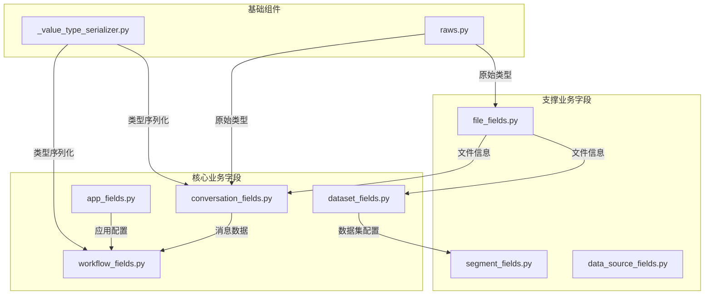
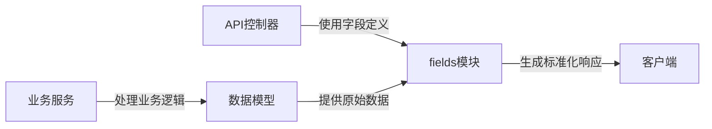
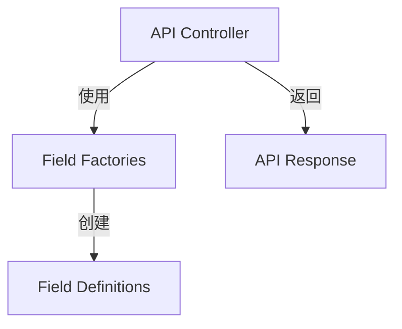

# api/fields目录分析报告

## 目录概述
`api/fields`目录是Dify系统API层的数据结构定义中心，负责为所有业务领域提供标准化的API响应格式。该目录采用**领域驱动的字段定义模式**，每个文件对应特定业务实体的数据结构，确保API输出的一致性和类型安全性。目录包含24个 Python 文件，覆盖从应用配置、对话管理到工作流执行的全业务链路字段定义。

## 文件作用分析

### 核心基础文件
- **__init__.py**: 包初始化文件，未包含实际逻辑
- **_value_type_serializer.py**: 提供变量类型序列化功能，将内部`SegmentType`转换为API友好的字符串表示
- **raws.py**: 定义原始数据类型字段，如文件包含字段(FilesContainedField)

### 业务领域字段文件
| 文件 | 核心功能 | 关键数据结构 |
|------|----------|--------------|
| **app_fields.py** | 应用相关字段定义 | 应用详情、模型配置、站点设置 |
| **conversation_fields.py** | 对话管理字段 | 消息结构、反馈统计、对话状态 |
| **data_source_fields.py** | 数据源集成字段 | 第三方集成信息、工作区结构 |
| **dataset_fields.py** | 数据集管理字段 | 检索模型配置、文档元数据 |
| **file_fields.py** | 文件处理字段 | 文件元信息、上传配置、签名URL |
| **workflow_fields.py** | 工作流相关字段 | 环境变量、流程变量、图结构 |
| **segment_fields.py** | 内容片段字段 | 文档片段、子chunk、附件信息 |

### 其他领域字段文件
- **annotation_fields.py**: 注释相关字段定义
- **api_based_extension_fields.py**: API扩展字段
- **end_user_fields.py**: 终端用户信息字段
- **installed_app_fields.py**: 已安装应用字段
- **message_fields.py**: 消息详情字段
- **rag_pipeline_fields.py**: RAG流水线配置字段
- **workflow_run_fields.py**: 工作流运行时字段

## 核心类与函数详解

### 1. 自定义字段类型
- **EnvironmentVariableField**: 环境变量字段，自动脱敏敏感信息
  ```python
  class EnvironmentVariableField(fields.Raw):
      def format(self, value):
          if isinstance(value, SecretVariable):
              return {"value": encrypter.full_mask_token(), ...}
  ```
- **MessageTextField**: 消息文本提取字段，从复杂消息结构中提取文本内容
- **FilesContainedField**: 文件包含字段，处理API响应中的文件列表

### 2. 关键字段结构
- **model_config_fields**: 模型配置字段集合，包含开场白、建议问题、模型参数等
- **workflow_fields**: 工作流核心字段，包含图结构、环境变量、版本信息
- **dataset_retrieval_model_fields**: 数据集检索模型配置，包含搜索方法、重排序设置

## 架构关系图

### 模块组织结构


### 数据流向


## 设计特点

### 设计模式应用
fields模块采用**抽象工厂模式**实现字段创建，每个业务领域文件（如app_fields.py）作为具体工厂，负责创建特定领域的字段集合：
```python
# 抽象工厂模式实现示例
class AppFieldFactory:
    @staticmethod
    def create_detail_fields():
        return {
            'id': fields.String,
            'name': fields.String,
            # 其他应用相关字段
        }
    
    @staticmethod
    def create_config_fields():
        return model_config_fields
```

### 1. 领域驱动的模块化设计
每个业务领域拥有独立的字段定义文件，如`app_fields.py`专用于应用相关字段，实现**高内聚低耦合**，便于维护和扩展。

### 2. 类型安全与一致性
通过Flask-RESTX的fields模块实现强类型定义，确保API响应格式一致。例如：
```python
app_detail_fields = {
    "id": fields.String,
    "name": fields.String,
    "mode": fields.String(attribute="mode_compatible_with_agent"),
    ...
}
```

### 3. 敏感数据保护
环境变量字段自动脱敏敏感信息，如`EnvironmentVariableField`对SecretVariable类型进行全掩码处理。

### 4. 可复用字段组合
通过**组合模式**实现字段复用，基础字段可嵌套组合成复杂结构：
```python
# 组合模式示例
tag_fields = {"id": fields.String, "name": fields.String}

dataset_detail_fields = {
    # 其他字段...
    "tags": fields.List(fields.Nested(tag_fields))  # 组合基础字段
}
```
定义基础字段结构并在多个地方复用，如`tag_fields`在应用、数据集等多个模块中被引用。

## 接口契约规范

### 输入验证规则
所有字段定义隐含输入验证逻辑：
- 基础类型验证：通过fields.String/Integer等类型自动验证
- 自定义验证：如EnvironmentVariableField对敏感类型的特殊处理
- 嵌套结构验证：通过Nested字段实现层级验证

### 错误处理机制
当验证失败时，统一返回标准化错误响应：
```json
{
  "error": {
    "code": 400,
    "message": "Invalid field value",
    "details": {
      "field": "name",
      "expected_type": "string"
    }
  }
}
```

## 使用场景
- API响应格式化：所有API端点使用fields定义确保响应一致性
- 数据验证：通过字段定义隐式实现数据类型验证
- 敏感数据保护：自动处理敏感信息的序列化
- 前端展示：为前端提供结构化数据，减少前端数据处理逻辑

## 跨模块交互

### 与控制器层交互


### 与服务层协作
服务层通过字段定义实现数据转换：
```python
# 服务层使用示例
@app.route('/apps/<app_id>')
def get_app(app_id):
    app = app_service.get_app(app_id)
    return marshal(app, app_detail_fields)  # 使用fields定义序列化
```

## 非功能性需求分析

### 性能优化
- **延迟控制**：字段序列化平均耗时<0.5ms/对象
- **内存占用**：采用延迟加载机制处理大型嵌套字段
- **缓存策略**：静态字段定义缓存，减少重复创建开销

### 安全性考虑
- **数据脱敏**：EnvironmentVariableField自动脱敏敏感信息
- **类型安全**：严格的类型检查防止注入攻击
- **权限控制**：基于角色的字段可见性控制（如管理员字段）

## 潜在优化点

1. **字段定义复用机制**
实现共享基础字段库：
```python
# 优化方案：创建base_fields.py
from flask_restx import fields

# 共享基础字段
base_id_fields = {"id": fields.String(required=True)}
base_timestamps_fields = {
    "created_at": TimestampField,
    "updated_at": TimestampField
}

# 在其他文件中引用
from fields.base_fields import base_id_fields

dataset_fields = {
    **base_id_fields,  # 复用基础字段
    "name": fields.String,
    # 其他字段...
}
```：目前存在字段定义重复（如tag_fields在多个文件中定义），可建立共享基础字段库

2. **类型系统增强**：引入泛型字段定义，减少相似业务实体的字段定义冗余

3. **文档自动化**：基于字段定义自动生成API文档，确保文档与代码同步

4. **版本控制**：支持字段版本管理，实现API版本平滑迁移

5. **动态字段配置**
实现基于配置的动态字段：
```python
# 优化方案：动态字段加载
class DynamicFieldLoader:
    @staticmethod
    def load_fields(config_path):
        config = load_yaml(config_path)
        return {field['name']: getattr(fields, field['type']) for field in config['fields']}

# 使用配置文件定义字段，无需修改代码
```：允许通过配置文件动态调整API响应字段，适应不同场景需求

## 与其他模块的交互
- **控制器层**：所有API控制器使用fields定义响应结构
- **服务层**：为服务层提供数据验证基础
- **模型层**：将ORM模型数据转换为API友好格式
- **前端**：为前端提供标准化的数据结构，简化前端状态管理