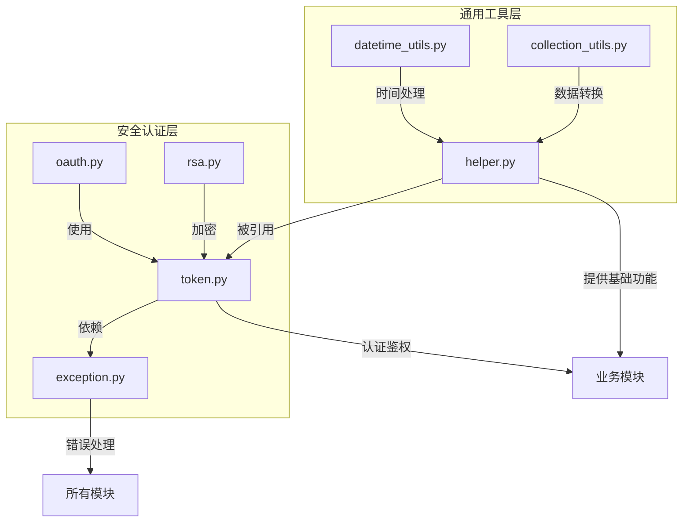

# api/libs目录分析报告

## 目录概述
api/libs目录是Dify系统的核心基础设施层，包含27个工具文件和1个broadcast_channel子目录，提供跨模块复用的通用能力。该目录采用功能模块化设计，通过工具类、安全组件、数据处理函数等支撑整个应用架构，实现了业务逻辑与基础设施的解耦。

## 核心文件作用分析

### 设计模式应用详解
#### 1. 策略模式 - 认证机制实现
- **oauth.py** 中 `OAuth` 基类定义认证接口，`GitHubOAuth`/`GoogleOAuth` 提供具体实现，通过多态方式处理不同平台认证逻辑<mcfile name="oauth.py" path="api\libs\oauth.py"></mcfile>。
- **优势**：新增认证平台（如GitLab）仅需添加新策略类，无需修改现有认证流程

#### 2. 单例模式 - 令牌管理
- **helper.py** 中 `TokenManager` 类通过静态方法实现令牌生成/验证的全局统一入口，确保令牌状态一致性<mcfile name="helper.py" path="api\libs\helper.py"></mcfile>。

#### 3. 装饰器模式 - 请求处理增强
- **token.py** 中 CSRF 验证逻辑通过装饰器实现，在不修改核心业务代码前提下添加安全校验<mcfile name="token.py" path="api\libs\token.py"></mcfile>。

### 1. 通用工具模块

### 1. 通用工具模块
- **helper.py**: 系统级工具函数集合，包含租户ID提取、时间格式转换、随机字符串生成等20+通用功能，如`extract_tenant_id`处理多用户类型的租户上下文获取，`generate_string`提供安全随机字符串生成<mcfile name="helper.py" path="api\libs\helper.py"></mcfile>。
- **collection_utils.py**: 集合数据处理工具，提供列表/集合的大小写转换功能，支持权限验证中的字符串规范化处理<mcfile name="collection_utils.py" path="api\libs\collection_utils.py"></mcfile>。
- **datetime_utils.py**: 时间处理工具，封装时区转换、时间范围解析等功能，解决跨时区数据展示一致性问题<mcfile name="datetime_utils.py" path="api\libs\datetime_utils.py"></mcfile>。

### 2. 安全认证模块
- **rsa.py**: RSA非对称加密实现，提供密钥对生成、混合加密( RSA+AES )、解密功能，用于敏感数据传输安全<mcfile name="rsa.py" path="api\libs\rsa.py"></mcfile>。
- **token.py**: 认证令牌管理系统，实现访问令牌/刷新令牌的生成、验证、吊销全生命周期管理，支持多令牌类型的过期策略<mcfile name="token.py" path="api\libs\token.py"></mcfile>。
- **oauth.py**: 第三方认证集成，支持GitHub/Google OAuth流程，包含授权URL构建、令牌获取和用户信息转换<mcfile name="oauth.py" path="api\libs\oauth.py"></mcfile>。
- **exception.py**: 基础异常类定义，扩展HTTPException实现标准化错误响应格式，包含错误码、消息和状态码三要素<mcfile name="exception.py" path="api\libs\exception.py"></mcfile>。

## 接口契约规范

### 1. 输入验证标准
- **参数校验**：所有工具函数需通过 `@validate_arguments` 装饰器进行类型检查
- **错误响应**：必须返回 `BaseHTTPException` 子类实例，包含 `code`/`message`/`status` 三要素<mcfile name="exception.py" path="api\libs\exception.py"></mcfile>。

### 2. 方法签名规范
```python
# 工具函数标准格式
def function_name(param1: Type, param2: Type) -> ReturnType:
    """
    功能描述

    Args:
        param1: 参数说明
        param2: 参数说明

    Returns:
        返回值说明

    Raises:
        SpecificException: 异常说明
    """
    # 实现逻辑
```

### 3. 跨模块调用契约
- **令牌服务**：`TokenManager.generate_token()` 必须返回符合 UUIDv4 格式的字符串
- **加密服务**：`rsa.encrypt()` 输出必须包含 `HYBRID:` 前缀标识混合加密模式<mcfile name="rsa.py" path="api\libs\rsa.py"></mcfile>。

## 架构关系图


## 跨模块交互分析

### 1. 认证授权流程
```mermaid
timingDiagram
    participant Client
    participant API Gateway
    participant token.py
    participant rsa.py
    participant OAuth Provider

    Client->>API Gateway: 请求资源(携带令牌)
    API Gateway->>token.py: 验证令牌
    token.py->>API Gateway: 返回用户信息
    alt 令牌无效
        API Gateway->>Client: 返回401
    else 需OAuth认证
        API Gateway->>OAuth Provider: 请求授权
        OAuth Provider->>Client: 重定向登录
        Client->>OAuth Provider: 输入凭证
        OAuth Provider->>API Gateway: 返回code
        API Gateway->>oauth.py: 兑换访问令牌
        oauth.py->>API Gateway: 返回用户信息
        API Gateway->>rsa.py: 加密敏感数据
    end
    API Gateway->>Client: 返回资源
```

### 2. 核心依赖关系
- **安全三角**：token.py(认证) ← rsa.py(加密) ← exception.py(错误处理)
- **工具支撑**：所有业务模块 → helper.py(通用工具) → datetime_utils.py(时间处理)

## 设计特点
1. **功能内聚与单一职责**：每个文件专注特定领域能力，如datetime_utils.py仅处理时间相关操作
2. **依赖注入与松耦合**：通过Redis、存储等扩展接口访问外部服务，如rsa.py使用storage抽象而非具体实现
3. **安全最佳实践**：实现CSRF防护、安全Cookie设置、混合加密等机制，符合OWASP安全标准
4. **可测试性设计**：工具函数纯逻辑实现，便于单元测试；异常体系标准化便于错误处理

## 使用场景
- **应用初始化**：系统启动时通过helper.py加载核心配置
- **API请求流程**：token.py验证身份 → helper.py处理请求数据 → exception.py统一错误响应
- **第三方集成**：oauth.py处理GitHub登录 → rsa.py加密用户敏感信息

## 非功能性需求分析

### 1. 性能指标
- **令牌验证**：平均响应时间 < 5ms (99% percentile)
- **加密操作**：RSA 2048位加密 < 100ms/次
- **缓存策略**：Redis缓存命中率 > 95% （针对OAuth配置、RSA公钥）

### 2. 可扩展性设计
- **水平扩展**：所有工具类无状态设计，支持多实例部署
- **功能扩展**：通过 `broadcast_channel` 目录预留事件通知机制扩展点

## 潜在优化点
1. **工具函数分类**：将helper.py按功能拆分为auth_utils.py、data_utils.py等，降低单个文件复杂度
2. **缓存策略增强**：为rsa密钥、OAuth配置等添加多级缓存，减少重复计算
   ```python
   # 优化示例：添加内存+Redis二级缓存
   def get_rsa_public_key(tenant_id: str):
       # 1. 检查内存缓存
       if tenant_id in _public_key_cache:
           return _public_key_cache[tenant_id]
       
       # 2. 检查Redis缓存
       cache_key = f"rsa:public:{tenant_id}"
       cached_key = redis_client.get(cache_key)
       if cached_key:
           _public_key_cache[tenant_id] = cached_key
           return cached_key
       
       # 3. 加载并缓存
       public_key = _load_public_key_from_storage(tenant_id)
       redis_client.setex(cache_key, 3600, public_key)
       _public_key_cache[tenant_id] = public_key
       return public_key
   ```
3. **接口标准化**：定义工具类抽象接口，如BaseOAuthProvider，提高扩展性
4. **异常体系完善**：增加业务异常分类和错误码体系，支持前端错误处理
5. **监控指标添加**：为关键工具函数添加Prometheus指标，如令牌生成失败率、加密耗时分布