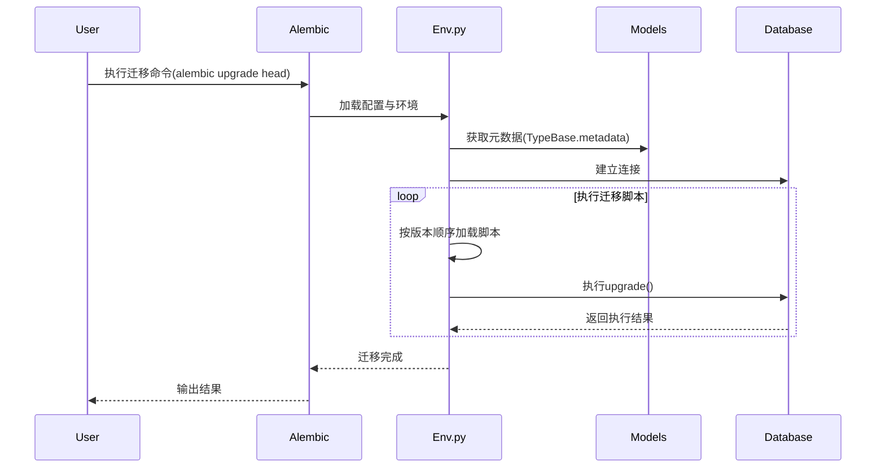
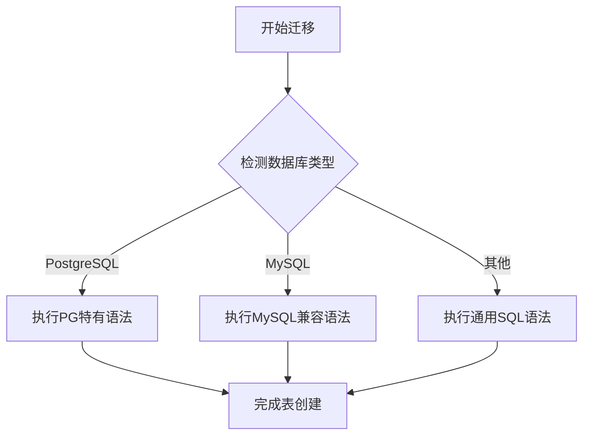
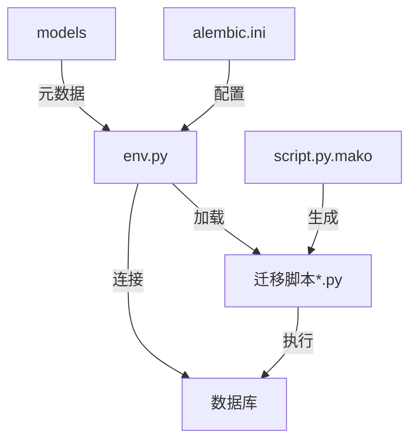

# Dify API Migrations 目录架构分析

## 目录概述
migrations目录是Dify系统的数据库版本控制中心，采用Alembic迁移工具实现 schema 变更管理。该目录包含4个核心配置文件和一个versions子目录（存储20+个按时间戳命名的迁移脚本），形成完整的数据库版本控制体系。

### 核心文件组成
- **配置文件**：env.py（迁移执行入口）、alembic.ini（Alembic工具配置）、script.py.mako（迁移脚本模板）
- **文档**：README（极简说明）
- **迁移脚本**：versions目录下的时间戳命名文件（如64b051264f32_init.py、2025_11_15_2102-09cfdda155d1_mysql_adaptation.py）

## 核心文件作用分析

### 1. 迁移执行引擎：env.py
系统迁移的核心控制器，实现以下关键功能：
- **双模式迁移**：支持online（实时数据库连接）和offline（生成SQL文件）两种模式
- **元数据管理**：通过`get_metadata()`加载TypeBase模型元数据
- **版本控制**：process_revision_directives钩子防止空迁移生成
- **数据库兼容性**：include_object函数过滤外键约束，适配不同数据库特性

关键代码片段展示其核心逻辑：
```python
# 数据库连接管理
def run_migrations_online():
    connectable = get_engine()
    with connectable.connect() as connection:
        context.configure(
            connection=connection,
            target_metadata=get_metadata(),
            process_revision_directives=process_revision_directives
        )
        with context.begin_transaction():
            context.run_migrations()
```

### 2. 工具配置中心：alembic.ini
Alembic工具的核心配置文件，定义：
- **迁移文件模板**：采用`%%(year)d_%%(month).2d_%%(day).2d_%%(hour).2d%%(minute).2d-%%(rev)s_%%(slug)s`命名格式
- **日志级别**：默认WARN级别，控制迁移过程日志输出
- **数据库连接**：通过动态获取SQLAlchemy URL实现配置解耦

### 3. 脚本生成模板：script.py.mako
迁移脚本的生成模板，定义标准迁移文件结构：
- 包含revision ID、依赖关系、创建日期等元数据
- 标准化upgrade()/downgrade()函数框架
- 支持自定义导入和代码生成逻辑

### 4. 版本化迁移脚本
versions目录下的脚本遵循**增量变更**原则，主要类型包括：
- **初始架构脚本**：如64b051264f32_init.py创建基础表结构
- **数据库适配脚本**：如mysql_adaptation.py处理不同数据库的类型差异
- **结构变更脚本**：添加/修改表、字段、索引等schema变更

示例脚本展示数据库兼容性处理策略：
```python
# 多数据库类型适配示例
def upgrade():
    conn = op.get_bind()
    if _is_pg(conn):
        op.create_table('accounts',
            sa.Column('id', postgresql.UUID(), server_default=sa.text('uuid_generate_v4()'), nullable=False),
            # PostgreSQL特有配置
        )
    else:
        op.create_table('accounts',
            sa.Column('id', models.types.StringUUID(), nullable=False),
            # 通用SQL配置
        )
```

## 架构关系图

### 迁移执行流程


### 版本演进流程


### 多数据库适配策略


### 迁移系统组件关系


### 版本演进流程


## 设计模式应用

### 1. 策略模式：多数据库适配
migrations系统通过策略模式实现跨数据库兼容，核心体现在：
- **环境检测**：`_is_pg(conn)`函数作为环境检测器
- **策略选择**：根据数据库类型执行不同DDL语句
- **策略实现**：PostgreSQL特有语法与通用SQL语法分离

```python
# 策略模式实现示例
def upgrade():
    conn = op.get_bind()
    if _is_pg(conn):
        # PostgreSQL策略
        op.execute('CREATE EXTENSION IF NOT EXISTS "uuid-ossp";')
        op.create_table('accounts', sa.Column('id', postgresql.UUID(), ...))
    else:
        # 默认策略
        op.create_table('accounts', sa.Column('id', models.types.StringUUID(), ...))
```

### 2. 模板方法模式：迁移流程框架
env.py中的迁移执行流程实现了模板方法模式：
- **抽象模板**：定义`run_migrations_online/offline`骨架方法
- **具体实现**：通过钩子函数`process_revision_directives`定制行为
- **流程控制**：固定迁移生命周期，允许步骤定制

## 设计特点分析

### 1. 数据库无关性设计
- 通过方言检测（`_is_pg(conn)`）实现跨数据库兼容
- 抽象化数据类型（如使用自定义StringUUID替代数据库特定UUID类型）
- 条件执行DDL语句适配不同数据库特性

### 2. 安全的版本控制
- 严格的版本依赖链（Revises字段）
- 原子化迁移单元（每个脚本专注单一变更）
- 完善的升级/降级双向操作

### 3. 自动化支持
- 集成Flask-Migrate实现模型变更自动检测
- 标准化脚本模板减少人工编写错误
- 空迁移过滤防止无效版本生成

## 接口契约规范

### 1. 迁移脚本编写标准
所有迁移脚本必须遵循以下契约：
- **双向操作**：必须同时实现upgrade()和downgrade()函数
- **幂等性保证**：重复执行同一迁移不会导致数据损坏
- **事务边界**：复杂变更需显式定义事务范围
- **依赖声明**：通过revises字段清晰定义版本依赖链

### 2. 错误处理机制
标准错误处理流程包括：
```python
try:
    # 执行迁移操作
    op.alter_column('table', 'column', existing_type=sa.String(), new_type=sa.Text())
except sa.exc.OperationalError as e:
    if 'lock timeout' in str(e):
        # 处理并发锁冲突
        op.execute('ROLLBACK;')
        raise RetryMigrationError("Database lock timeout, please retry")
    raise
```

## 使用场景与最佳实践

### 典型使用场景
- **开发环境**：通过`flask db migrate`自动生成变更脚本
- **生产环境**：执行`flask db upgrade`应用变更
- **版本回滚**：使用`flask db downgrade <revision>`恢复到指定版本
- **多环境同步**：通过版本号统一不同环境的数据库结构

### 非功能性需求分析

### 1. 性能优化
- **批量操作**：大表变更采用分批次处理
  ```python
  # 大表数据迁移优化示例
  batch_size = 1000
  offset = 0
  while True:
      records = conn.execute(sa.text("SELECT id FROM large_table LIMIT :batch OFFSET :offset"),
                            {'batch': batch_size, 'offset': offset}).fetchall()
      if not records:
          break
      # 处理记录...
      offset += batch_size
  ```
- **索引策略**：在低峰期创建索引，避免锁表
- **事务控制**：拆分长事务为短事务序列

### 2. 安全性考虑
- **数据验证**：迁移前后添加数据一致性检查
- **权限最小化**：迁移账户仅授予必要权限
- **审计跟踪**：记录所有schema变更操作日志

## 潜在优化点
1. **迁移脚本复用**：构建通用操作库

```python
# 通用操作库实现示例 (migrations/utils/db_ops.py)
from alembic import op
import sqlalchemy as sa

def add_audit_columns(table_name):
    """为表添加标准审计字段"""
    with op.batch_alter_table(table_name) as batch_op:
        batch_op.add_column(sa.Column('created_by', sa.String(255), nullable=True))
        batch_op.add_column(sa.Column('updated_by', sa.String(255), nullable=True))
        batch_op.create_index(f'{table_name}_audit_idx', ['created_by', 'updated_by'])

# 在迁移脚本中使用
from migrations.utils.db_ops import add_audit_columns

def upgrade():
    add_audit_columns('accounts')
    add_audit_columns('datasets')
```
2. **迁移测试框架**：实现自动化测试

```python
# tests/migrations/test_migrations.py
import pytest
from alembic.command import upgrade
alembic_cfg = get_alembic_config()

@pytest.mark.db
class TestMigrations:
    def test_migration_sequence(self, db_session):
        # 测试完整迁移序列
        upgrade(alembic_cfg, 'base')
        upgrade(alembic_cfg, '64b051264f32')
        upgrade(alembic_cfg, 'head')
        # 验证schema状态
        assert 'accounts' in db_session.bind.table_names()
        assert 'api_tokens' in db_session.bind.table_names()

    def test_downgrade(self, db_session):
        # 测试降级功能
        upgrade(alembic_cfg, 'head')
        downgrade(alembic_cfg, '-1')
        # 验证降级后状态
        with pytest.raises(Exception):
            db_session.execute(sa.text("SELECT new_column FROM accounts"))
```
3. **并行迁移支持**：设计分区迁移策略应对大数据量表变更
4. **变更影响分析**：在脚本中添加表大小检查等前置验证
5. **自动化迁移流水线**：集成CI/CD实现变更自动检测与应用

## 总结
migrations目录通过Alembic实现了成熟的数据库版本控制方案，核心价值在于：
- 提供可追溯的数据库变更历史
- 确保开发与生产环境的 schema 一致性
- 支持安全的版本升级与回滚
- 适配多数据库类型的灵活架构

遵循本文档中的最佳实践，可有效管理数据库演进过程，降低架构变更风险。