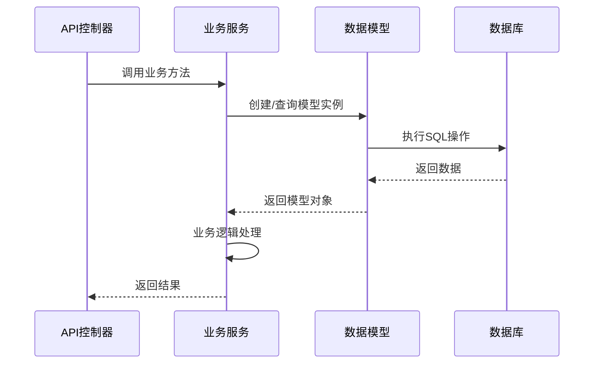
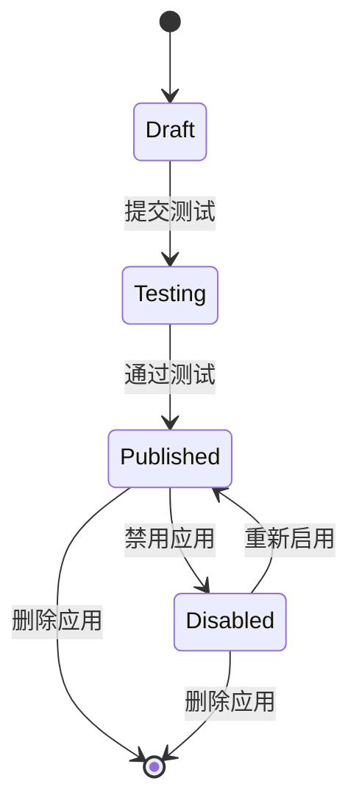
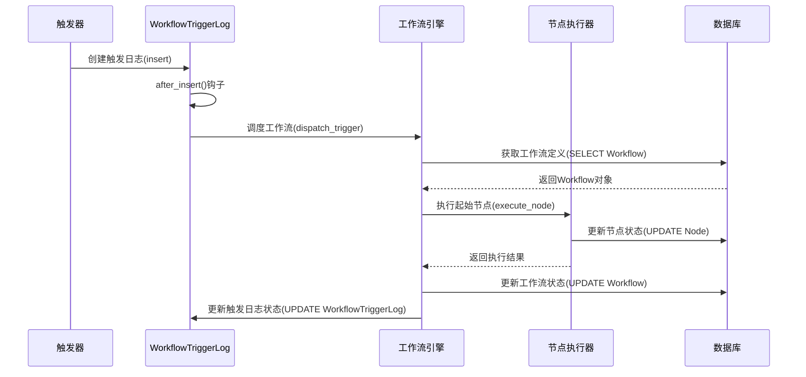
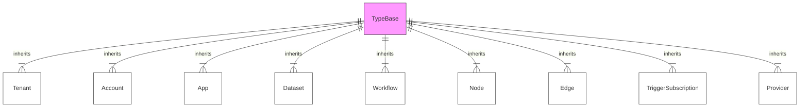
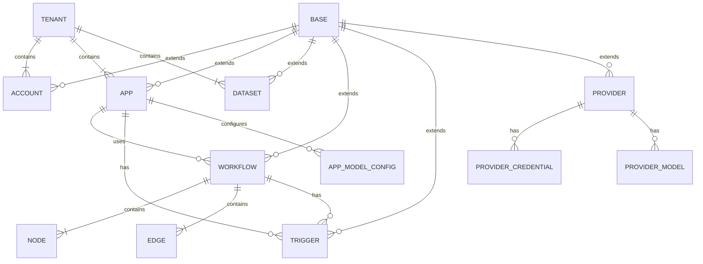
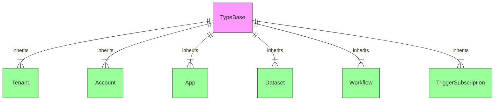

# Dify API Models 目录架构分析

## 目录概述
api/models目录包含18个核心文件，构成了Dify系统的数据模型层，实现业务实体的持久化与关系管理。该目录采用领域驱动设计(DDD)思想，将业务概念转化为结构化数据模型，通过SQLAlchemy ORM框架实现与数据库的交互。核心模型包括账户体系(tenant/account)、应用管理(app/model)、工作流引擎(workflow/trigger)、第三方集成(provider)等，共同构建了系统的数据基础架构。

## 核心文件分析

### 基础框架文件
- **base.py**：定义基础模型类`TypeBase`和默认字段混合类，提供统一的主键生成、时间戳管理和ORM配置，所有业务模型均继承自此基础类，确保代码复用和一致性。
- **engine.py**：数据库引擎配置，初始化SQLAlchemy实例，管理数据库连接池和会话生命周期，实现与多数据库类型的适配。
- **types.py**：扩展数据库字段类型，提供UUID、长文本、JSON等复杂类型的ORM映射，解决不同数据库系统间的类型兼容性问题。
- **enums.py**：定义系统枚举类型，包括用户角色、工作流状态、触发器类型等，确保状态值的一致性和类型安全。

### 核心业务模型
- **account.py**：实现多租户架构的核心模型，包含`Tenant`(租户)和`Account`(账户)实体，支持租户隔离、角色权限和多租户数据共享策略。
- **dataset.py**：定义数据集模型体系，包含`Dataset`、`Document`和`Segment`三级结构，实现文档的分块存储、权限控制和检索配置。
- **model.py**：应用核心模型，定义`App`类及其配置关联，支持多模式应用(聊天/工作流/代理)，包含应用元数据、访问控制和API限流策略。
- **workflow.py**：工作流引擎数据模型，包含`Workflow`、`Node`和`Edge`实体，实现工作流定义、节点配置和执行状态管理。
- **trigger.py**：触发器系统模型，包含`TriggerSubscription`和`WorkflowTriggerLog`，支持Webhook、定时任务和插件事件等多类型触发机制。
- **provider.py**：第三方服务集成模型，管理API提供商配置、凭证存储和配额控制，支持系统级和租户级的服务配置隔离。

### 任务与执行模型
- **task.py**：任务调度模型，基于Celery实现异步任务的状态跟踪和结果存储，支持任务重试、优先级排序和执行状态监控。
- **web.py**：Web相关数据模型，包含`SavedMessage`和`PinnedConversation`，管理用户消息存储和会话状态。

## 数据库兼容性策略
系统采用数据库无关设计，通过SQLAlchemy的抽象层和自定义字段类型实现多数据库支持：
- 使用`types.py`中定义的兼容类型替代数据库特定类型
- 通过策略模式实现不同数据库的SQL语法适配
- 在迁移脚本中处理数据库特有功能(如MySQL的字符集配置)

## 架构关系图

### 模型层交互时序图


### 应用状态机图


### 工作流执行时序图


### 类继承层次图


### 组件关系图


### 模型继承关系图


## 设计模式应用

### 策略模式：多数据库适配
模型层通过`types.py`中定义的抽象字段类型实现数据库无关性，例如`StringUUID`类型在不同数据库系统中会映射为相应的原生类型：
```python
class StringUUID(TypeDecorator):
    impl = String(36)
    
    def load_dialect_impl(self, dialect):
        if dialect.name == 'postgresql':
            return dialect.type_descriptor(UUID())
        return dialect.type_descriptor(String(36))
```

### 观察者模式：触发器事件机制
`trigger.py`中的`WorkflowTriggerLog`实现了观察者模式，当触发器事件发生时，系统自动记录日志并触发后续工作流执行：
```python
class WorkflowTriggerLog(TypeBase):
    # ...字段定义...
    
    def after_insert(self):
        from services.trigger_service import TriggerService
        TriggerService().dispatch_trigger(self)
```

### 单例模式：数据库引擎
`engine.py`中实现了数据库引擎的单例模式，确保全局只有一个数据库连接池实例：
```python
class DBEngine:
    _instance = None
    
    def __new__(cls):
        if cls._instance is None:
            cls._instance = create_engine(Config.DATABASE_URI)
        return cls._instance
```

## 接口契约规范

### 模型方法签名标准
所有业务模型需遵循统一的方法签名规范，确保接口一致性：
```python
# 标准查询方法
def get_by_id(cls, session: Session, obj_id: str) -> Optional['TypeBase']:
    return session.query(cls).filter(cls.id == obj_id).first()

# 批量查询方法
def batch_get_by_ids(cls, session: Session, obj_ids: list[str]) -> dict[str, 'TypeBase']:
    objs = session.query(cls).filter(cls.id.in_(obj_ids)).all()
    return {obj.id: obj for obj in objs}
```

### 数据验证机制
模型字段需实现严格的数据验证，通过SQLAlchemy的validators装饰器确保数据完整性：
```python
from sqlalchemy.orm import validates

class App(TypeBase):
    # ...字段定义...
    
    @validates('name')
    def validate_name(self, key, value):
        if len(value) > 255:
            raise ValueError('应用名称长度不能超过255个字符')
        return value
```

## 非功能性需求分析

### 可扩展性设计
- **水平扩展支持**：模型设计避免依赖数据库特定功能，支持读写分离和分库分表
- **动态字段**：通过JSON类型字段支持业务扩展，避免频繁表结构变更
- **插件化模型**：支持通过插件动态扩展模型功能，如：
```python
class PluginAwareModel(TypeBase):
    plugin_data = mapped_column(sa.JSON, default={})
    
    def get_plugin_field(self, plugin_id: str, field: str) -> Any:
        return self.plugin_data.get(plugin_id, {}).get(field)
    
    def set_plugin_field(self, plugin_id: str, field: str, value: Any):
        if plugin_id not in self.plugin_data:
            self.plugin_data[plugin_id] = {}
        self.plugin_data[plugin_id][field] = value
```

### 性能优化策略
- **索引优化**：为高频查询字段组合添加复合索引，如`App`表的`(tenant_id, status)`索引
- **延迟加载**：通过SQLAlchemy的`lazy='selectinload'`优化关联数据加载
- **查询缓存**：实现基于Redis的查询结果缓存，减少数据库访问：
```python
def get_cached_by_id(cls, session: Session, obj_id: str, ttl: int = 300) -> Optional['TypeBase']:
    cache_key = f'{cls.__name__}:{obj_id}'
    cached_data = redis_client.get(cache_key)
    if cached_data:
        return cls(**json.loads(cached_data))
    
    obj = cls.get_by_id(session, obj_id)
    if obj:
        redis_client.setex(cache_key, ttl, json.dumps(obj.to_dict()))
    return obj
```

### 数据安全策略
- **字段加密**：敏感字段（如API密钥）通过`encryption.py`工具进行加密存储
- **行级安全**：所有查询强制附加租户ID过滤，防止跨租户数据访问
- **审计日志**：关键模型操作记录变更日志，支持数据溯源

## 设计模式应用

### 代理模式：延迟加载实现
通过代理模式实现关联数据的延迟加载，优化初始查询性能：
```python
class LazyRelationProxy:
    def __init__(self, cls, foreign_key):
        self.cls = cls
        self.foreign_key = foreign_key
        self._target = None
        
    def __get__(self, instance, owner):
        if not instance or self._target:
            return self._target
        
        session = db.session.object_session(instance)
        self._target = session.query(self.cls).filter(
            self.cls.id == getattr(instance, self.foreign_key)
        ).first()
        return self._target

# 在模型中使用
class App(TypeBase):
    workflow_id = mapped_column(StringUUID)
    workflow = LazyRelationProxy('Workflow', 'workflow_id')
```

### 装饰器模式：模型行为增强
使用装饰器为模型添加横切关注点，如审计日志和缓存：
```python
def audit_log(model_method):
    def wrapper(self, *args, **kwargs):
        result = model_method(self, *args, **kwargs)
        AuditLogService.log_change(
            model_name=self.__class__.__name__,
            obj_id=self.id,
            action=model_method.__name__
        )
        return result
    return wrapper

class App(TypeBase):
    @audit_log
    def update_status(self, new_status):
        self.status = new_status
```

### 模板方法模式：基础模型框架
`base.py`中的`TypeBase`实现模板方法模式，定义模型生命周期的骨架流程，子类可重写特定步骤：
```python
class TypeBase:
    # 模板方法
    def save(self, session: Session):
        self.before_save()
        session.add(self)
        session.commit()
        self.after_save()
        
    # 钩子方法（可重写）
    def before_save(self):
        pass
    
    def after_save(self):
        pass
```

### 工厂模式：模型实例化
通过工厂方法统一创建模型实例，支持不同场景下的对象初始化策略：
```python
class ModelFactory:
    @staticmethod
    def create_model(model_type: str, **kwargs) -> TypeBase:
        model_cls = MODEL_REGISTRY.get(model_type)
        if not model_cls:
            raise ValueError(f'未知模型类型: {model_type}')
        return model_cls(** kwargs)
```

## 设计特点

### 领域驱动设计
模型设计紧密映射业务领域概念，如`Workflow`、`Trigger`等实体直接对应系统核心功能，属性设计反映业务规则(如`App`的`mode`字段控制应用行为模式)。

### 多租户架构支持
通过`tenant_id`字段实现数据隔离，所有业务模型均包含租户标识，确保多租户环境下的数据安全性和独立性。

### 灵活的关联关系
采用松散耦合的关联策略，通过ID引用而非强外键约束，提高系统的灵活性和可扩展性，如`App`通过`workflow_id`关联`Workflow`。

### 统一的基础结构
所有模型共享`TypeBase`提供的基础功能，包括UUID主键、创建/更新时间戳和软删除支持，确保代码一致性和可维护性。

## 使用场景
- **应用开发**：通过`App`和`AppModelConfig`配置不同类型的AI应用
- **工作流编排**：使用`Workflow`、`Node`和`Edge`定义业务流程
- **第三方集成**：通过`Provider`模型配置外部API服务
- **事件驱动**：利用`Trigger`系统实现基于事件的工作流触发

## 潜在优化点
1. **查询优化技术**：
   - 使用`exists()`进行存在性检查而非`count()`
   - 利用`selectinload`预加载关联数据避免N+1查询问题
   ```python
   # 优化前
   apps = session.query(App).all()
   for app in apps:
       workflow = app.workflow  # 触发额外查询
   
   # 优化后
   apps = session.query(App).options(
       selectinload(App.workflow)
   ).all()
   ```

3. **模型关系强化**：增加显式的ORM关系定义，提高查询效率
   ```python
   class App(TypeBase):
       # 显式定义一对多关系
       workflow = relationship('Workflow', back_populates='app', lazy='selectinload')
   ```

4. **数据迁移兼容性**：
   - 新增字段采用默认值确保旧数据兼容
   - 使用数据库视图实现模型版本过渡
   ```python
   # 版本过渡视图示例
   @sa.event.listens_for(Base.metadata, 'after_create')
   def create_compatibility_views(target, connection, **kwargs):
       connection.execute(sa.text("""
           CREATE VIEW app_v1 AS
           SELECT id, name, description, 'chat' as mode
           FROM apps
       """))
   ```
   ```python
   class App(TypeBase):
       # 显式定义一对多关系
       workflow = relationship('Workflow', back_populates='app', lazy='selectinload')
   ```
2. **索引优化**：为频繁查询的字段组合添加复合索引
3. **缓存策略**：实现热点数据的二级缓存（内存+Redis）
   ```python
   def get_with_cache(cls, session: Session, obj_id: str) -> Optional['TypeBase']:
       # 内存缓存优先
       if obj_id in cls._memory_cache:
           return cls._memory_cache[obj_id]
       
       # Redis缓存次之
       obj = cls.get_cached_by_id(session, obj_id)
       if obj:
           cls._memory_cache[obj_id] = obj
           # 设置内存缓存过期时间
           threading.Timer(60, cls._evict_from_memory_cache, args=[obj_id]).start()
       return obj
   ```
4. **批量操作支持**：添加批量插入/更新方法，优化大数据量场景
   ```python
   @classmethod
   def bulk_insert(cls, session: Session, objs: list['TypeBase']):
       session.bulk_save_objects(objs)
       session.commit()
   ```
2. **索引优化**：为频繁查询的字段组合添加复合索引
3. **缓存策略**：实现热点数据的缓存机制，减少数据库访问
4. **批量操作支持**：添加批量插入/更新方法，优化大数据量场景