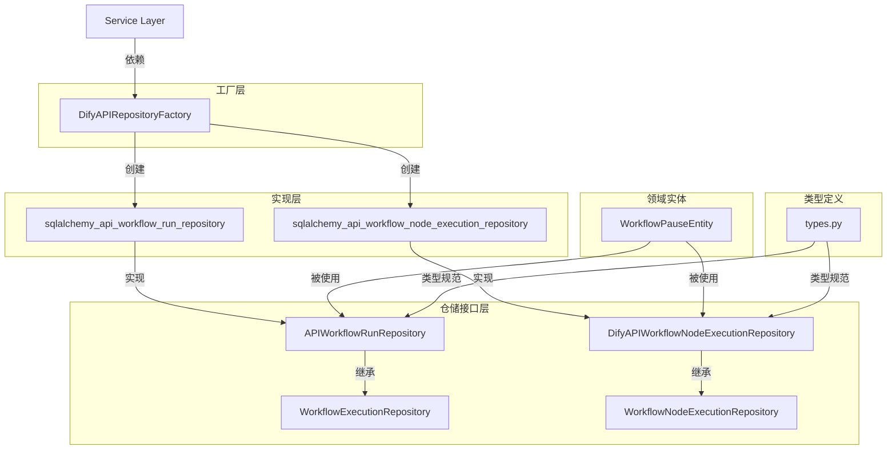
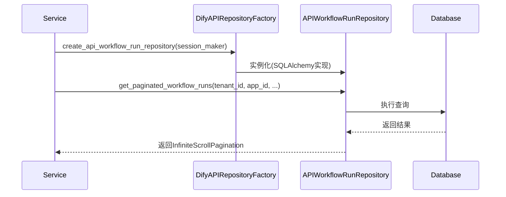

# Dify 仓储层架构分析文档

## 1. 目录概述

api/repositories目录实现了Dify系统的数据访问层，采用仓储模式(Repository Pattern)抽象数据库操作，通过依赖注入实现业务逻辑与数据访问的解耦。该目录包含9个核心文件/子目录，组织如下：

- **接口定义层**：`types.py`(数据类型规范)、`api_workflow_run_repository.py`(工作流运行仓储接口)、`api_workflow_node_execution_repository.py`(节点执行仓储接口)
- **实现层**：`sqlalchemy_api_workflow_run_repository.py`、`sqlalchemy_api_workflow_node_execution_repository.py`(SQLAlchemy具体实现)
- **工厂层**：`factory.py`(仓储实例创建工厂)
- **领域实体**：`entities/workflow_pause.py`(工作流暂停领域模型)
- **包定义**：`__init__.py`

## 2. 核心文件分析

### 2.1 基础框架文件

#### 2.1.1 types.py
定义仓储层使用的数据类型规范，包含4个统计相关的TypedDict：
- `DailyRunsStats`: 每日运行统计
- `DailyTerminalsStats`: 每日终端统计
- `DailyTokenCostStats`: 每日Token消耗统计
- `AverageInteractionStats`: 平均交互统计

这些类型确保了跨仓储数据交换的一致性，为上层服务提供强类型支持。

#### 2.1.2 factory.py
实现`DifyAPIRepositoryFactory`工厂类，通过依赖注入模式创建仓储实例：
- 基于配置动态导入仓储实现类
- 支持`create_api_workflow_node_execution_repository`和`create_api_workflow_run_repository`方法
- 处理仓储实例化异常，抛出`RepositoryImportError`

该工厂类解耦了仓储接口与具体实现，支持多数据库后端无缝切换。

### 2.2 核心业务仓储

#### 2.2.1 工作流运行仓储

**api_workflow_run_repository.py**定义`APIWorkflowRunRepository`协议，扩展自`WorkflowExecutionRepository`，提供工作流运行生命周期管理：
- 分页查询(`get_paginated_workflow_runs`)
- 运行统计(`get_workflow_runs_count`)
- 过期数据清理(`get_expired_runs_batch`)
- 多租户隔离支持

**sqlalchemy_api_workflow_run_repository.py**提供SQLAlchemy实现：
- 使用SQLAlchemy 2.0风格查询
- 实现游标式分页(基于created_at字段)
- 批量删除与事务管理
- 多条件过滤与统计查询

#### 2.2.2 节点执行仓储

**api_workflow_node_execution_repository.py**定义`DifyAPIWorkflowNodeExecutionRepository`协议，扩展自`WorkflowNodeExecutionRepository`：
- 节点最近执行查询(`get_node_last_execution`)
- 批量删除与备份(`delete_expired_executions`, `get_expired_executions_batch`)
- 按应用/运行ID筛选

**sqlalchemy_api_workflow_node_execution_repository.py**提供SQLAlchemy实现：
- 预加载关联数据(`preload_offload_data`)
- 批量删除优化(分页查询+ID批量删除)
- 事务安全的数据清理

### 2.3 领域实体

**entities/workflow_pause.py**定义`WorkflowPauseEntity`抽象基类，代表工作流暂停领域模型：
- 核心属性：id、workflow_execution_id
- 状态管理：resumed_at
- 暂停原因：`get_pause_reasons`返回`PauseReason`序列
- 状态序列化：`get_state`返回字节流

该实体与仓储层解耦，专注于领域逻辑表达。

## 3. 架构关系图

### 3.1 组件关系图


### 3.2 仓储调用时序图


## 4. 设计模式深化应用

### 4.1 策略模式：多数据库后端适配

通过策略模式实现不同ORM后端无缝切换，工厂类根据配置选择具体策略：

```python
# 新增多后端支持的工厂实现
class EnhancedDifyAPIRepositoryFactory(DifyAPIRepositoryFactory):
    @classmethod
    def create_api_workflow_run_repository(
        cls, session_maker: sessionmaker[Session]
    ) -> APIWorkflowRunRepository:
        backend_type = dify_config.DB_BACKEND_TYPE
        
        if backend_type == 'sqlalchemy':
            from repositories.sqlalchemy_api_workflow_run_repository import DifyAPISQLAlchemyWorkflowRunRepository
            return DifyAPISQLAlchemyWorkflowRunRepository(session_maker)
        elif backend_type == 'asyncpg':
            from repositories.asyncpg_api_workflow_run_repository import DifyAPIAsyncPGWorkflowRunRepository
            return DifyAPIAsyncPGWorkflowRunRepository(session_maker)
        elif backend_type == 'dynamodb':
            from repositories.dynamodb_api_workflow_run_repository import DifyAPIDynamoDBWorkflowRunRepository
            return DifyAPIDynamoDBWorkflowRunRepository(session_maker)
        else:
            raise RepositoryImportError(f'Unsupported database backend: {backend_type}')
```

### 4.2 装饰器模式：查询缓存增强

实现缓存装饰器为仓储添加透明缓存能力，无需修改核心逻辑：

```python
from functools import wraps
from typing import Any, Callable, TypeVar
from redis import Redis

T = TypeVar('T')
redis_client = Redis.from_url(dify_config.REDIS_URL)

def repository_cache(key_prefix: str, ttl: int = 300) -> Callable[[Callable[..., T]], Callable[..., T]]:
    def decorator(func: Callable[..., T]) -> Callable[..., T]:
        @wraps(func)
        def wrapper(*args: Any, **kwargs: Any) -> T:
            # 生成缓存键（包含租户ID和方法参数）
            tenant_id = kwargs.get('tenant_id') or args[0] if args else ''
            cache_key = f'{key_prefix}:{tenant_id}:{hash(frozenset(kwargs.items()))}'
            
            # 尝试从缓存获取
            cached_result = redis_client.get(cache_key)
            if cached_result:
                return deserialize(cached_result)
            
            # 执行原始方法
            result = func(*args, **kwargs)
            
            # 存入缓存
            redis_client.setex(cache_key, ttl, serialize(result))
            return result
        return wrapper
    return decorator

# 应用于仓储方法
class CachedDifyAPISQLAlchemyWorkflowRunRepository(DifyAPISQLAlchemyWorkflowRunRepository):
    @repository_cache('workflow_run:by_id', ttl=60)
    def get_workflow_run_by_id(self, tenant_id: str, app_id: str, run_id: str) -> WorkflowRun | None:
        return super().get_workflow_run_by_id(tenant_id, app_id, run_id)
```

### 4.3 模板方法模式：仓储操作标准化

通过抽象基类定义标准操作流程，子类仅实现差异化步骤：

### 4.4 观察者模式：仓储事件通知机制

实现仓储操作的事件通知系统，解耦数据变更与后续处理：

### 4.5 中介者模式：多仓储协调中心

通过中介者模式简化多个仓储间的复杂交互，集中管理跨仓储业务逻辑：

```python
from typing import Dict, Type

class RepositoryMediator:
    def __init__(self):
        self._repositories: Dict[Type, Any] = {}

    def register_repository(self, repo_type: Type, repository: Any) -> None:
        self._repositories[repo_type] = repository

    def get_repository(self, repo_type: Type) -> Any:
        if repo_type not in self._repositories:
            raise ValueError(f'Repository not registered: {repo_type}')
        return self._repositories[repo_type]

    def orchestrate_workflow_archive(self, tenant_id: str, workflow_id: str, archive_date: datetime) -> None:
        """协调工作流归档的跨仓储操作"""
        run_repo = self.get_repository(APIWorkflowRunRepository)
        node_repo = self.get_repository(DifyAPIWorkflowNodeExecutionRepository)

        # 1. 获取待归档的工作流运行
        runs = run_repo.get_workflow_runs_by_workflow(tenant_id, workflow_id, before_date=archive_date)
        run_ids = [run.id for run in runs]

        # 2. 归档运行记录
        run_repo.archive_runs(tenant_id, run_ids)

        # 3. 归档关联的节点执行记录
        for run_id in run_ids:
            node_repo.archive_executions_by_run_id(tenant_id, run_id)

        # 4. 发送归档完成事件
        self._notify_archive_completed(tenant_id, workflow_id, len(run_ids))

    def _notify_archive_completed(self, tenant_id: str, workflow_id: str, run_count: int) -> None:
        # 实现归档完成通知逻辑
        ...

# 使用示例
mediator = RepositoryMediator()
mediator.register_repository(APIWorkflowRunRepository, run_repo)
mediator.register_repository(DifyAPIWorkflowNodeExecutionRepository, node_repo)
mediator.orchestrate_workflow_archive('tenant-123', 'workflow-456', datetime(2023, 1, 1))
```

```python
from typing import List, Callable
from dataclasses import dataclass

@dataclass
class RepositoryEvent:
    event_type: str  # 'created', 'updated', 'deleted'
    entity_type: str
    entity_id: str
    tenant_id: str
    data: dict

class RepositoryObservable:
    def __init__(self):
        self._observers: List[Callable[[RepositoryEvent], None]] = []

    def register_observer(self, observer: Callable[[RepositoryEvent], None]) -> None:
        self._observers.append(observer)

    def unregister_observer(self, observer: Callable[[RepositoryEvent], None]) -> None:
        self._observers.remove(observer)

    def _notify_observers(self, event: RepositoryEvent) -> None:
        for observer in self._observers:
            observer(event)

# 应用于仓储实现
class ObservableSQLAlchemyWorkflowRunRepository(DifyAPISQLAlchemyWorkflowRunRepository, RepositoryObservable):
    def __init__(self, session_maker: sessionmaker[Session]):
        super().__init__(session_maker)
        RepositoryObservable.__init__(self)

    def delete_expired_executions(self, tenant_id: str, before_date: datetime, batch_size: int = 1000) -> int:
        deleted_count = super().delete_expired_executions(tenant_id, before_date, batch_size)
        self._notify_observers(RepositoryEvent(
            event_type='deleted',
            entity_type='workflow_run',
            entity_id=f'batch:{tenant_id}:{before_date}',
            tenant_id=tenant_id,
            data={'count': deleted_count, 'before_date': before_date.isoformat()}
        ))
        return deleted_count

# 使用示例：注册审计日志观察者
class AuditLogObserver:
    @staticmethod
    def handle_event(event: RepositoryEvent):
        logger.info(f"Repository event: {event.event_type} {event.entity_type} {event.entity_id}")
        # 写入审计日志或发送通知

repo = ObservableSQLAlchemyWorkflowRunRepository(session_maker)
repo.register_observer(AuditLogObserver.handle_event)
```

```python
from abc import ABC, abstractmethod
from sqlalchemy.orm import Session

class TemplateSQLAlchemyRepository(ABC):
    def __init__(self, session_maker: sessionmaker[Session]):
        self._session_maker = session_maker
        
    def execute_with_transaction(self, operation: Callable[[Session], T]) -> T:
        """模板方法：定义事务执行流程"""
        with self._session_maker() as session:
            try:
                result = operation(session)
                session.commit()
                return result
            except Exception as e:
                session.rollback()
                self._handle_exception(e)
                raise
    
    @abstractmethod
    def _handle_exception(self, e: Exception) -> None:
        """子类实现异常处理策略"""
        pass

# 工作流仓储实现
class DifyAPISQLAlchemyWorkflowRunRepository(TemplateSQLAlchemyRepository, APIWorkflowRunRepository):
    def _handle_exception(self, e: Exception) -> None:
        # 工作流特定异常处理
        logger.error(f"Workflow run repository error: {str(e)}")
        if isinstance(e, ConcurrentUpdateError):
            metrics.incr('workflow_concurrent_update_errors')

    def delete_expired_executions(self, tenant_id: str, before_date: datetime, batch_size: int = 1000) -> int:
        return self.execute_with_transaction(lambda session: self._delete_expired_in_transaction(session, tenant_id, before_date, batch_size))
    
    def _delete_expired_in_transaction(self, session: Session, tenant_id: str, before_date: datetime, batch_size: int) -> int:
        # 具体删除逻辑
        ...
```

## 5. 设计特点

### 5.1 仓储模式应用
采用仓储模式隔离业务逻辑与数据访问：
- 接口与实现分离(协议+SQLAlchemy实现)
- 领域模型与数据模型解耦
- 统一的数据访问接口

### 4.2 依赖注入
通过工厂模式实现依赖注入：
- 服务层通过工厂获取仓储实例
- 配置驱动的实现类选择
- 便于单元测试(模拟仓储实现)

### 4.3 多租户支持
所有仓储方法包含tenant_id参数：
- 查询条件自动附加租户过滤
- 数据隔离与访问控制
- 租户级数据统计与清理

### 4.4 批量操作优化
针对大数据量场景优化：
- 分页查询避免内存溢出
- 批量删除减少事务开销
- 游标式分页提升查询效率

## 5. 潜在优化点

### 5.1 缓存策略
为高频查询添加二级缓存：
```python
from sqlalchemy.orm import Session
from functools import lru_cache

class CachedSQLAlchemyAPIWorkflowRunRepository(DifyAPISQLAlchemyWorkflowRunRepository):
    @lru_cache(maxsize=128)
    def get_workflow_run_by_id(self, tenant_id: str, app_id: str, run_id: str) -> WorkflowRun | None:
        return super().get_workflow_run_by_id(tenant_id, app_id, run_id)

    # 添加缓存失效机制
    def invalidate_cache(self, run_id: str):
        self.get_workflow_run_by_id.cache_clear()
```

### 5.2 异步查询支持
引入异步SQLAlchemy支持高并发场景：
```python
from sqlalchemy.ext.asyncio import AsyncSession, async_sessionmaker

class AsyncSQLAlchemyAPIWorkflowRunRepository(APIWorkflowRunRepository):
    def __init__(self, session_maker: async_sessionmaker[AsyncSession]):
        self._session_maker = session_maker

    async def get_paginated_workflow_runs(self, tenant_id: str, app_id: str, ...):
        async with self._session_maker() as session:
            # 异步查询实现
```

### 5.3 读写分离
实现主从分离提升吞吐量：
```python
class ReadWriteSplitSQLAlchemyAPIWorkflowRunRepository(DifyAPISQLAlchemyWorkflowRunRepository):
    def __init__(self, write_session_maker: sessionmaker[Session], read_session_maker: sessionmaker[Session]):
        self._write_session_maker = write_session_maker
        self._read_session_maker = read_session_maker

    def get_paginated_workflow_runs(self, ...):
        # 使用读库连接
        with self._read_session_maker() as session:
            ...

    def delete_expired_runs_batch(self, ...):
        # 使用写库连接
        with self._write_session_maker() as session:
            ...
```

### 5.4 仓储基类抽象

### 5.5 分库分表策略

针对超大规模数据场景，实现基于租户ID的分库分表路由：

```python
from sqlalchemy import create_engine
from sqlalchemy.orm import sessionmaker
from shardingsphere import ShardingSphereDriver

class ShardingWorkflowRunRepository(DifyAPISQLAlchemyWorkflowRunRepository):
    def __init__(self, sharding_config: dict):
        # 初始化分库分表驱动
        self.driver = ShardingSphereDriver(sharding_config)
        super().__init__(sessionmaker(bind=self.driver.get_engine()))

    def _get_sharding_key(self, tenant_id: str) -> str:
        # 基于租户ID的一致性哈希分库
        return f'db_{hash(tenant_id) % 8}'

    def get_paginated_workflow_runs(self, tenant_id: str, app_id: str, triggered_from, limit=20, last_id=None, status=None):
        # 动态路由到对应分库
        self.driver.using_database(self._get_sharding_key(tenant_id))
        return super().get_paginated_workflow_runs(tenant_id, app_id, triggered_from, limit, last_id, status)
```

### 5.6 动态查询构建器

### 5.7 数据库索引优化策略

针对高频查询路径设计复合索引与部分索引，提升查询性能：

```python
# 在SQLAlchemy模型中定义优化索引
class WorkflowRun(Base):
    __tablename__ = 'workflow_runs'
    
    # 基础字段定义...
    
    # 复合索引：优化按租户、应用和触发源的查询
    __table_args__ = (
        Index('idx_tenant_app_trigger', 'tenant_id', 'app_id', 'triggered_from'),
        # 部分索引：只索引调试相关的运行记录
        Index('idx_debug_runs', 'tenant_id', 'app_id', 'created_at',
              postgresql_where=and_(triggered_from == 'debugging', status == 'failed')),
        # GIN索引：优化JSONB字段查询
        Index('idx_workflow_config', 'config', postgresql_using='gin'),
    )

# 仓储查询中显式使用索引提示
class OptimizedSQLAlchemyWorkflowRunRepository(DifyAPISQLAlchemyWorkflowRunRepository):
    def get_paginated_workflow_runs(self, tenant_id: str, app_id: str, triggered_from, limit=20, last_id=None, status=None):
        base_stmt = select(WorkflowRun).where(
            WorkflowRun.tenant_id == tenant_id,
            WorkflowRun.app_id == app_id,
        ).with_hint(WorkflowRun, 'USE INDEX (idx_tenant_app_trigger)')
        
        # 其余查询逻辑...
        return super()._execute_paginated_query(base_stmt, limit, last_id)
```

### 5.8 查询性能监控与分析

集成查询性能监控工具，持续优化仓储层性能：

```python
from sqlalchemy.event import listen
from prometheus_client import Histogram, Counter
import time

# 定义性能指标
QUERY_DURATION = Histogram('repo_query_duration_seconds', 'Repository query duration', ['repo_name', 'method'])
QUERY_COUNT = Counter('repo_query_total', 'Total repository queries', ['repo_name', 'method', 'status'])

class MonitoredSQLAlchemyRepository:
    @classmethod
    def monitor_queries(cls, repo_instance):
        """为仓储实例添加查询监控"""
        repo_name = repo_instance.__class__.__name__

        def before_cursor_execute(conn, cursor, statement, parameters, context, executemany):
            conn.info.setdefault('query_start_time', []).append(time.time())

        def after_cursor_execute(conn, cursor, statement, parameters, context, executemany):
            start_time = conn.info['query_start_time'].pop()
            duration = time.time() - start_time
            
            # 提取方法名（假设查询由仓储方法触发）
            method_name = context.execution_options.get('repo_method', 'unknown')
            
            # 记录指标
            QUERY_DURATION.labels(repo_name=repo_name, method=method_name).observe(duration)
            QUERY_COUNT.labels(repo_name=repo_name, method=method_name, status='success').inc()

        # 监听SQLAlchemy事件
        listen(repo_instance._session_maker().bind, 'before_cursor_execute', before_cursor_execute)
        listen(repo_instance._session_maker().bind, 'after_cursor_execute', after_cursor_execute)
        return repo_instance

# 使用示例
run_repo = DifyAPISQLAlchemyWorkflowRunRepository(session_maker)
MonitoredSQLAlchemyRepository.monitor_queries(run_repo)
```

实现类型安全的动态查询构建器，简化复杂条件组合：

```python
from typing import Dict, Any, Callable
from sqlalchemy import Column, and_, or_

class QueryBuilder:
    def __init__(self, model):
        self.model = model
        self.conditions = []
        self.joins = []
        self.order_by = []

    def add_condition(self, column: Column, operator: str, value: Any) -> 'QueryBuilder':
        operators = {
            'eq': lambda c, v: c == v,
            'ne': lambda c, v: c != v,
            'gt': lambda c, v: c > v,
            'ge': lambda c, v: c >= v,
            'lt': lambda c, v: c < v,
            'le': lambda c, v: c <= v,
            'in': lambda c, v: c.in_(v),
            'like': lambda c, v: c.like(v)
        }
        if operator not in operators:
            raise ValueError(f'Unsupported operator: {operator}')
        self.conditions.append(operators[operator](column, value))
        return self

    def add_join(self, join_model, on_clause: Callable) -> 'QueryBuilder':
        self.joins.append((join_model, on_clause))
        return self

    def set_order_by(self, column: Column, ascending: bool = True) -> 'QueryBuilder':
        self.order_by.append(column.asc() if ascending else column.desc())
        return self

    def build(self):
        query = select(self.model)
        for join_model, on_clause in self.joins:
            query = query.join(join_model, on_clause)
        if self.conditions:
            query = query.where(and_(*self.conditions))
        if self.order_by:
            query = query.order_by(*self.order_by)
        return query

# 使用示例
qb = QueryBuilder(WorkflowRun)
query = qb.add_condition(WorkflowRun.tenant_id, 'eq', 'tenant-123')
         .add_condition(WorkflowRun.status, 'in', ['running', 'succeeded'])
         .set_order_by(WorkflowRun.created_at, ascending=False)
         .build()
```
提取公共逻辑到抽象基类：
```python
from abc import ABC, abstractmethod

class BaseSQLAlchemyRepository(ABC):
    def __init__(self, session_maker: sessionmaker[Session]):
        self._session_maker = session_maker

    def _batch_operation(self, query, batch_size=1000):
        # 通用批量操作实现
        ...

# 继承使用
class DifyAPISQLAlchemyWorkflowRunRepository(BaseSQLAlchemyRepository, APIWorkflowRunRepository):
    ...
```