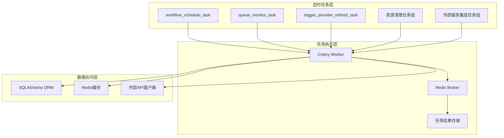
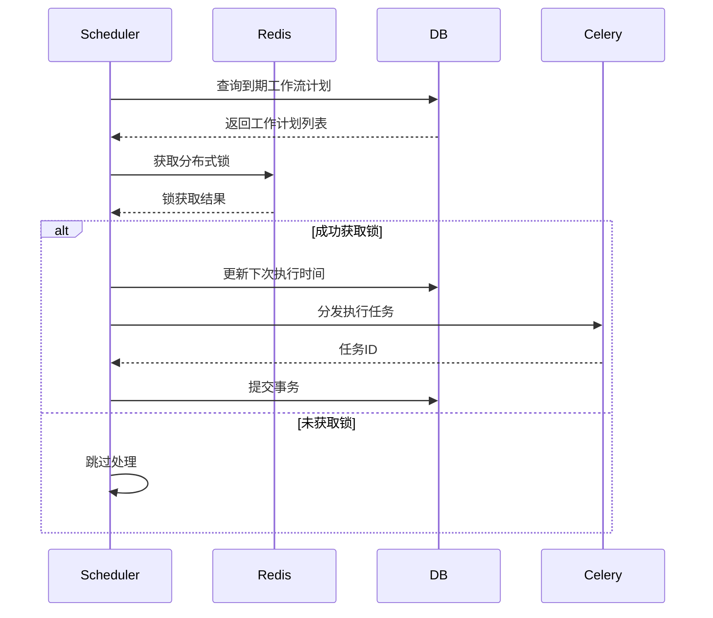

# Dify API Schedule 模块架构分析

## 1. 目录概述

api/schedule目录包含11个核心任务文件，负责系统各类定时任务的调度与执行，涵盖工作流调度、资源清理、外部服务集成等关键功能。所有任务均基于Celery分布式任务队列实现，采用定时触发机制确保系统稳定性与资源高效利用。

## 2. 文件作用分析

### 2.1 核心调度任务

- **workflow_schedule_task.py**：工作流调度核心实现，通过Celery定时任务轮询待执行的工作流计划，计算下次执行时间并分发任务至执行队列。采用批量处理与乐观锁机制避免任务重复执行，支持配置最大并发限制。

- **queue_monitor_task.py**：队列监控任务，定期检查Celery队列长度，当超过阈值时发送告警邮件。使用Redis客户端直接监控Broker状态，支持自定义告警阈值与接收邮箱。

- **trigger_provider_refresh_task.py**：触发器订阅刷新任务，扫描即将过期的凭证与订阅，通过Redis分布式锁机制避免重复刷新，支持批量任务分发与阈值配置。

### 2.2 资源清理任务

- **clean_messages.py**：消息清理任务，根据租户套餐类型（如SANDBOX）清理过期消息及关联数据（反馈、注解、文件等）。采用Redis缓存租户套餐信息提升查询性能，支持批量删除与事务管理。

- **clean_unused_datasets_task.py**：数据集清理任务，识别长期未使用且无新增文档的数据集，清理索引并禁用文档。支持多套餐配置与清理日志记录，采用分页查询避免大数据集操作压力。

- **clean_embedding_cache_task.py**：向量缓存清理任务，按配置天数清理过期的Embedding记录，采用批量删除策略减少数据库负载。

- **clean_workflow_runlogs_precise.py**：工作流日志清理任务，级联删除过期工作流运行记录及关联数据（节点执行、变量、消息等）。实现重试机制与批量处理，支持事务嵌套与错误恢复。

### 2.3 外部服务集成任务

- **create_tidb_serverless_task.py**：TiDB Serverless集群创建任务，根据配置数量预创建空闲集群，支持批量操作与异常处理。

- **update_tidb_serverless_status_task.py**：TiDB集群状态更新任务，批量检查创建中集群状态并更新，支持分页处理与API错误捕获。

- **check_upgradable_plugin_task.py**：插件升级检查任务，根据租户自动升级策略定时检查插件更新，支持并发控制与任务间隔调度。

- **mail_clean_document_notify_task.py**：文档清理通知任务，向受影响租户发送数据集清理通知邮件，支持多语言模板与批量发送。

## 3. 架构关系图

### 3.1 组件关系图



### 3.2 工作流调度时序图



## 4. 设计模式深化应用

### 4.1 观察者模式（任务状态变更通知）

实现任务执行状态变更的事件通知机制，当任务状态变化时自动触发关联操作：

```python
from dataclasses import dataclass
from typing import Callable, List

@dataclass
class TaskEvent:
    task_id: str
    status: str
    timestamp: float

class TaskObservable:
    def __init__(self):
        self._observers: List[Callable[[TaskEvent], None]] = []

    def register_observer(self, observer: Callable[[TaskEvent], None]):
        self._observers.append(observer)

    def notify_observers(self, event: TaskEvent):
        for observer in self._observers:
            observer(event)

# 应用示例：工作流任务状态变更通知
class WorkflowTask(TaskObservable):
    def mark_completed(self):
        event = TaskEvent(
            task_id=self.id,
            status="completed",
            timestamp=time.time()
        )
        self.notify_observers(event)

# 日志记录观察者
def log_task_status(event: TaskEvent):
    logger.info(f"Task {event.task_id} status changed to {event.status}")

# 指标收集观察者
def collect_task_metrics(event: TaskEvent):
    metrics_client.increment(f"task.{event.status}")

# 注册观察者
task = WorkflowTask()
task.register_observer(log_task_status)
task.register_observer(collect_task_metrics)
```

### 4.2 策略模式（多清理策略实现）

定义不同资源类型的清理策略，实现算法与上下文分离：

```python
from abc import ABC, abstractmethod

class CleanupStrategy(ABC):
    @abstractmethod
def clean(self, session, resource_ids: List[str]) -> int:
        pass

class MessageCleanupStrategy(CleanupStrategy):
    def clean(self, session, resource_ids: List[str]) -> int:
        # 消息清理实现
        return session.query(Message).where(Message.id.in_(resource_ids)).delete()

class DatasetCleanupStrategy(CleanupStrategy):
    def clean(self, session, resource_ids: List[str]) -> int:
        # 数据集清理实现
        index_processor = IndexProcessorFactory().init_index_processor()
        for dataset_id in resource_ids:
            index_processor.clean(dataset_id)
        return len(resource_ids)

# 策略上下文
class ResourceCleaner:
    def __init__(self, strategy: CleanupStrategy):
        self._strategy = strategy

    def execute(self, session, resource_ids: List[str]) -> int:
        return self._strategy.clean(session, resource_ids)

# 应用示例
message_cleaner = ResourceCleaner(MessageCleanupStrategy())
dataset_cleaner = ResourceCleaner(DatasetCleanupStrategy())
```

### 4.3 中介者模式（多任务协调）

实现任务协调器统一管理相关任务的执行顺序与依赖关系：

```python
from typing import List

class TaskMediator:
    def __init__(self):
        self._tasks = []
        self._dependencies = {}

    def register_task(self, task, dependencies: List[str] = None):
        """注册任务及其依赖"""
        self._tasks.append(task)
        self._dependencies[task.__name__] = dependencies or []

    def execute(self, task_name, **kwargs):
        """执行任务及依赖"""
        # 解析依赖链
        execution_order = []
        self._build_execution_order(task_name, execution_order, set())

        # 按顺序执行
        results = {}
        for task in execution_order:
            task_func = next(t for t in self._tasks if t.__name__ == task)
            results[task] = task_func(** kwargs)
        return results

    def _build_execution_order(self, task_name, order, visited):
        """构建任务执行顺序"""
        if task_name in visited:
            return
        visited.add(task_name)
        for dep in self._dependencies.get(task_name, []):
            self._build_execution_order(dep, order, visited)
        order.append(task_name)

# 应用示例
mediator = TaskMediator()
mediator.register_task(clean_embedding_cache_task)
mediator.register_task(clean_unused_datasets_task, dependencies=['clean_embedding_cache_task'])
mediator.register_task(mail_clean_document_notify_task, dependencies=['clean_unused_datasets_task'])

# 执行带依赖的任务链
mediator.execute('mail_clean_document_notify_task')
```

### 4.4 断路器模式（外部服务容错）

保护系统免受外部服务故障影响，实现自动恢复机制：

```python
from tenacity import retry, stop_after_attempt, wait_exponential, retry_if_exception_type
from requests.exceptions import RequestException

class CircuitBreaker:
    def __init__(self, failure_threshold=5, recovery_timeout=60):
        self.failure_threshold = failure_threshold
        self.recovery_timeout = recovery_timeout
        self.failure_count = 0
        self.last_failure_time = 0
        self.state = 'CLOSED'

    def is_allowed(self):
        """检查是否允许请求"""
        if self.state == 'OPEN':
            if time.time() - self.last_failure_time > self.recovery_timeout:
                self.state = 'HALF_OPEN'
                return True
            return False
        return True

    def record_success(self):
        """记录成功请求"""
        self.failure_count = 0
        self.state = 'CLOSED'

    def record_failure(self):
        """记录失败请求"""
        self.failure_count += 1
        self.last_failure_time = time.time()
        if self.failure_count >= self.failure_threshold:
            self.state = 'OPEN'

# TiDB服务调用保护
class ProtectedTidbService(TidbService):
    def __init__(self):
        super().__init__()
        self.circuit_breaker = CircuitBreaker()

    @retry(
        stop=stop_after_attempt(3),
        wait=wait_exponential(multiplier=1, min=2, max=10),
        retry=retry_if_exception_type(RequestException)
    )
    def batch_create_tidb_serverless_cluster(self, **kwargs):
        if not self.circuit_breaker.is_allowed():
            raise Exception("Circuit breaker is OPEN")
        try:
            result = super().batch_create_tidb_serverless_cluster(** kwargs)
            self.circuit_breaker.record_success()
            return result
        except Exception as e:
            self.circuit_breaker.record_failure()
            raise
```

定义不同资源类型的清理策略，实现算法与上下文分离：

```python
from abc import ABC, abstractmethod

class CleanupStrategy(ABC):
    @abstractmethod
def clean(self, session, resource_ids: List[str]) -> int:
        pass

class MessageCleanupStrategy(CleanupStrategy):
    def clean(self, session, resource_ids: List[str]) -> int:
        # 消息清理实现
        return session.query(Message).where(Message.id.in_(resource_ids)).delete()

class DatasetCleanupStrategy(CleanupStrategy):
    def clean(self, session, resource_ids: List[str]) -> int:
        # 数据集清理实现
        index_processor = IndexProcessorFactory().init_index_processor()
        for dataset_id in resource_ids:
            index_processor.clean(dataset_id)
        return len(resource_ids)

# 策略上下文
class ResourceCleaner:
    def __init__(self, strategy: CleanupStrategy):
        self._strategy = strategy

    def execute(self, session, resource_ids: List[str]) -> int:
        return self._strategy.clean(session, resource_ids)

# 应用示例
message_cleaner = ResourceCleaner(MessageCleanupStrategy())
dataset_cleaner = ResourceCleaner(DatasetCleanupStrategy())
```

## 5. 设计特点

### 4.1 任务隔离与资源控制
- 采用队列隔离策略：不同类型任务分配至专用队列（如schedule_poller、dataset、trigger_refresh_publisher）
- 实现批量处理机制：所有清理任务均支持批量操作，通过limit参数控制单次处理量
- 内置限流保护：工作流调度支持最大并发限制，插件升级检查实现任务间隔调度

### 4.2 分布式协调与可靠性保障
- 基于Redis的分布式锁：防止任务重复执行（trigger_provider_refresh_task）
- 事务嵌套与重试机制：工作流日志清理实现多级事务与失败重试
- 乐观锁并发控制：使用SELECT FOR UPDATE SKIP LOCKED避免资源争用

### 4.3 可配置与可扩展设计
- 全配置驱动：所有阈值、开关均通过配置中心管理（dify_config）
- 模块化任务结构：每个任务独立实现，通过统一接口注册至Celery
- 多租户支持：基于租户ID的资源隔离与权限控制

## 5. 潜在优化点

### 5.1 事件驱动调度机制

将传统轮询模式升级为事件驱动架构，基于Celery Beat的定时任务与Redis Pub/Sub结合实现即时响应：

```python
from celery import Celery
from celery.signals import beat_init
import redis

# 初始化Redis订阅
redis_client = redis.Redis.from_url(dify_config.REDIS_URL)
channel = 'task_schedule_events'

@beat_init.connect
def init_schedule_listener(sender, **kwargs):
    """启动时初始化事件监听器"""
    pubsub = redis_client.pubsub()
    pubsub.subscribe(channel)
    sender.app.add_periodic_task(1.0, process_schedule_events.s(pubsub), name='event-driven-scheduler')

@app.task
def process_schedule_events(pubsub):
    """处理调度事件"""
    for message in pubsub.get_message(ignore_subscribe_messages=True, timeout=0.1):
        if message:
            event_data = json.loads(message['data'])
            schedule_id = event_data['schedule_id']
            run_schedule_trigger.delay(schedule_id)

# 发布调度事件示例
def trigger_schedule_event(schedule_id):
    redis_client.publish(channel, json.dumps({'schedule_id': schedule_id}))
```

### 5.2 Kubernetes自动扩缩容集成

基于任务队列长度实现Worker动态扩缩容，通过HPA (Horizontal Pod Autoscaler)配置：

```yaml
apiVersion: autoscaling/v2
kind: HorizontalPodAutoscaler
metadata:
  name: celery-worker-scaler
spec:
  scaleTargetRef:
    apiVersion: apps/v1
    kind: Deployment
    name: celery-worker
  minReplicas: 2
  maxReplicas: 20
  metrics:
  - type: External
    external:
      metric:
        name: redis_key_value
        selector:
          matchLabels:
            redis_key: queue_length:schedule_poller
      target:
        type: Value
        value: 100
```

### 5.3 增强型指标收集

实现细粒度任务指标监控，支持任务类型、执行时长、错误率等多维度分析：

```python
from prometheus_client import Counter, Histogram, Gauge

# 定义指标
task_total = Counter('task_total', 'Total task count', ['task_type', 'status'])
task_duration = Histogram('task_duration_seconds', 'Task execution duration', ['task_type'])
queue_length = Gauge('queue_length', 'Current queue length', ['queue_name'])

# 任务装饰器集成
def instrument_task(task_func):
    @wraps(task_func)
    def wrapper(*args, **kwargs):
        task_type = task_func.__name__
        task_total.labels(task_type=task_type, status='started').inc()
        with task_duration.labels(task_type=task_type).time():
            try:
                result = task_func(*args, **kwargs)
                task_total.labels(task_type=task_type, status='completed').inc()
                return result
            except Exception:
                task_total.labels(task_type=task_type, status='failed').inc()
                raise
    return wrapper

# 应用示例
@app.task
def update_tidb_serverless_status_task():
    # 更新队列长度指标
    queue_length.labels(queue_name='dataset').set(get_queue_length('dataset'))
    # 业务逻辑...
```

### 5.4 任务调度优化
  - 基于租户SLA的优先级队列：实现多级优先级任务队列，根据租户等级动态调整任务执行顺序
    ```python
    from kombu import Queue
    
    app.conf.task_queues = (
        Queue('high_priority', routing_key='task.high'),
        Queue('medium_priority', routing_key='task.medium'),
        Queue('low_priority', routing_key='task.low'),
    )
    
    app.conf.task_routes = {
        'tasks.critical.*': {'queue': 'high_priority', 'routing_key': 'task.high'},
        'tasks.normal.*': {'queue': 'medium_priority', 'routing_key': 'task.medium'},
        'tasks.background.*': {'queue': 'low_priority', 'routing_key': 'task.low'},
    }
    
    # 动态优先级分配
    def get_task_priority(tenant_id):
        tenant = get_tenant(tenant_id)
        if tenant.tier == 'ENTERPRISE':
            return 'high_priority'
        return 'medium_priority'
    
    # 应用示例
    def dispatch_task(task_func, tenant_id, **kwargs):
        queue = get_task_priority(tenant_id)
        task_func.apply_async(queue=queue,** kwargs)
    ```

### 5.5 安全加固策略
  - 任务参数验证：使用Pydantic对所有任务输入参数进行类型验证与清洗
  - 敏感数据处理：实现任务参数脱敏日志记录，避免敏感信息泄露
    ```python
    from pydantic import BaseModel, validator
    import logging
    
    class TaskLogger(logging.LoggerAdapter):
        def process(self, msg, kwargs):
            # 脱敏处理
            sanitized_msg = msg.replace(self.extra['tenant_id'], '***')
            return sanitized_msg, kwargs
    
    # 参数验证模型
    class DatasetCleanupParams(BaseModel):
        tenant_id: str
        dataset_ids: List[str]
        
        @validator('dataset_ids')
        def validate_dataset_ids(cls, v):
            if not v or len(v) > 100:
                raise ValueError('Dataset IDs must be 1-100 items')
            return v
    
    # 应用示例
    @app.task
    def clean_unused_datasets_task(params_json):
        params = DatasetCleanupParams.parse_raw(params_json)
        logger = TaskLogger(logging.getLogger(__name__), {'tenant_id': params.tenant_id})
        logger.info(f'Cleaning datasets: {params.dataset_ids}')
        # 业务逻辑...
    ```

### 5.6 资源控制优化
- 实现动态任务优先级：基于任务类型与租户等级调整执行优先级
- 引入任务依赖管理：支持任务间依赖关系定义与执行顺序控制
- 自适应调度频率：根据系统负载自动调整任务执行间隔

### 5.2 资源利用优化
- 任务执行预热：对高频任务实现Worker预热与资源预留
- 批量操作合并：优化数据库批量操作SQL，减少事务提交次数
- 缓存策略增强：扩大租户套餐等静态数据缓存范围与时长

### 5.3 监控与可观测性
- 任务执行指标埋点：增加执行耗时、成功率等Prometheus指标
- 分布式追踪集成：支持OpenTelemetry追踪任务执行全链路
- 智能告警策略：基于历史数据建立动态阈值告警机制