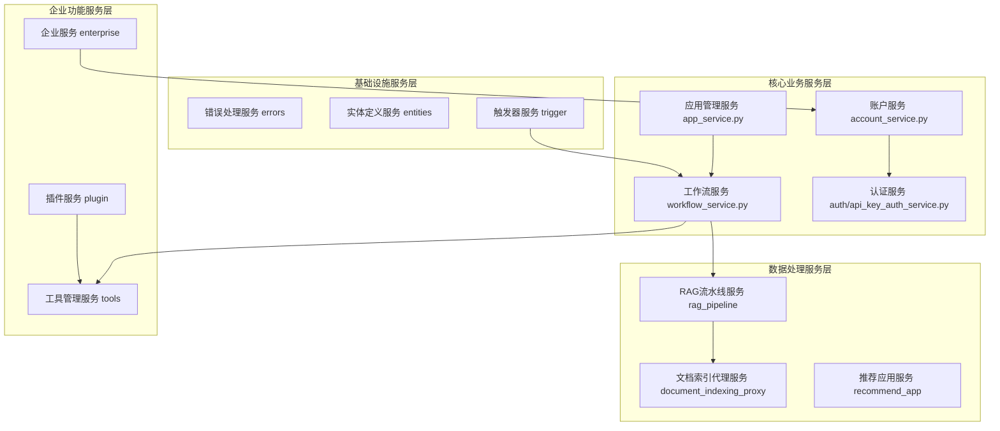
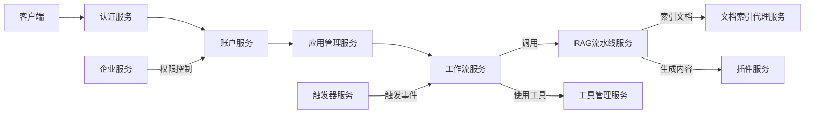

# Dify API Services 架构分析

## 目录
- [服务层整体架构](#服务层整体架构)
- [核心业务服务模块](#核心业务服务模块)
- [数据处理服务模块](#数据处理服务模块)
- [企业功能服务模块](#企业功能服务模块)
- [基础设施服务模块](#基础设施服务模块)
- [服务间交互关系](#服务间交互关系)
- [设计模式应用](#设计模式应用)
- [技术架构特点](#技术架构特点)
- [未来架构演进建议](#未来架构演进建议)

## 服务层整体架构

Dify的api/services目录采用模块化架构设计，将系统功能划分为多个业务服务模块，每个模块专注于特定领域的功能实现。



## 核心业务服务模块

### 账户服务 (account_service.py)
- 提供用户账户管理功能
- 处理用户注册、登录、权限验证等核心业务逻辑
- 集成身份验证和授权系统

### 工作流服务 (workflow_service.py)
- 实现工作流全生命周期管理，包括创建、更新、发布和执行
- 支持工作流版本控制和状态管理（草稿/发布状态）
- 提供节点执行记录查询和工作流同步功能
- 包含图结构校验、凭据策略检查及计费限制逻辑

**核心代码示例**：
```python
# 工作流发布逻辑
def publish_workflow(self, workflow_id: str, version: str) -> WorkflowEntity:
    # 版本验证
    self._validate_workflow_version(workflow_id, version)
    # 图结构校验
    self._validate_workflow_graph(workflow_id)
    # 凭据策略检查
    self._check_credential_strategy(workflow_id)
    # 计费限制检查
    self._check_billing_limits(workflow_id)
    # 执行发布
    return self._do_publish(workflow_id, version)
```

### 认证服务 (auth/api_key_auth_service.py)
- 实现API密钥认证管理
- 提供API密钥的创建、查询、绑定和加密存储功能
- 处理凭据获取和权限验证

### 应用管理服务 (app_service.py)
- 提供应用的CRUD操作
- 支持应用的分页查询
- 处理应用创建时的模型配置

## 数据处理服务模块

### 文档索引代理服务 (document_indexing_proxy)
- 基于代理模式设计，通过DocumentIndexingTaskProxy类实现文档索引任务调度
- 支持普通和优先级任务队列
- 提供文档去重机制（DuplicateDocumentIndexingTaskProxy）
- 核心文件：
  - document_indexing_task_proxy.py: 文档索引任务代理实现
  - duplicate_document_indexing_task_proxy.py: 文档去重索引任务实现

### RAG流水线服务 (rag_pipeline)
- 实现RAG（检索增强生成）流水线的完整生命周期管理
- 提供流水线模板管理和工作流处理功能
- 支持内容生成、单轮迭代生成和循环生成
- 基于租户订阅计划将任务分发到不同优先级队列
- 核心文件：
  - rag_pipeline.py: RAG流水线核心服务实现
  - pipeline_generate_service.py: 流水线内容生成服务
  - rag_pipeline_task_proxy.py: 任务调度与分发

### 推荐应用服务 (recommend_app)
- 基于抽象工厂模式设计，提供多种推荐应用检索方式
- 定义了推荐应用检索的抽象接口(RecommendAppRetrievalBase)
- 通过工厂类(RecommendAppRetrievalFactory)根据模式返回不同实现:
  - 远程检索(RemoteRecommendAppRetrieval)
  - 数据库检索(DatabaseRecommendAppRetrieval)
  - 内置检索(BuildInRecommendAppRetrieval)

> **注意**：推荐应用服务当前未实现独立的service.py文件，而是通过工厂模式动态选择检索实现。

## 企业功能服务模块

### 企业服务 (enterprise)
- 提供企业级功能支持，包括多租户管理
- 实现企业信息查询和工作区信息获取
- 处理Web应用访问权限验证和访问模式管理
- 提供插件凭证策略合规性检查

### 插件服务 (plugin/plugin_service.py)
- 负责插件全生命周期管理
- 提供插件版本检查、安装、更新和卸载功能
- 实现插件缓存机制和市场交互
- 处理插件资产和资源管理
- 包含插件安装权限控制和安全检查

### 工具管理服务 (tools)
- 提供工具注册、配置和管理功能
- 支持工具提供商列表查询和缓存管理
- 处理工具转换和标签管理
- 核心文件:
  - tools_manage_service.py: 工具管理核心实现
  - api_tools_manage_service.py: API工具管理
  - builtin_tools_manage_service.py: 内置工具管理
  - workflow_tools_manage_service.py: 工作流工具集成

## 基础设施服务模块

### 错误处理服务 (errors)
- 定义基础服务异常类(BaseServiceError)
- 提供统一的错误处理机制
- 异常分层设计：业务异常、系统异常、外部服务异常

### 实体定义服务 (entities)
- 定义系统核心数据模型和实体
- 包含模型提供者实体和RAG流水线实体
- 核心文件: model_provider_entities.py, knowledge_entities/rag_pipeline_entities.py

### 触发器服务 (trigger/trigger_service.py)
- 实现触发器事件处理和调用
- 支持端点请求处理和插件触发器关系同步
- 集成订阅管理和事件分发
- 使用Celery进行异步任务调度

## 服务间交互关系



## 设计模式应用

1. **代理模式**：文档索引代理服务
   - 通过DocumentIndexingTaskProxy代理实际索引任务的执行
   - 实现任务队列优先级和去重逻辑

2. **工厂模式**：推荐应用服务的检索工厂
   ```python
   # 工厂模式实现示例
   class RecommendAppRetrievalFactory:
       @staticmethod
       def get_recommend_app_factory(mode: str):
           match mode:
               case REMOTE: return RemoteRecommendAppRetrieval
               case DATABASE: return DatabaseRecommendAppRetrieval
               case BUILDIN: return BuildInRecommendAppRetrieval
   ```

3. **策略模式**：RAG流水线的不同生成策略
   - 根据内容类型选择不同的生成策略
   - 实现：PipelineGenerateService中的不同生成方法

4. **观察者模式**：触发器服务的事件分发
   - 触发器事件发生时通知订阅者
   - 使用Celery任务实现异步通知

5. **单例模式**：各服务类的静态方法设计
   - 确保服务实例的全局唯一性
   - 避免重复初始化资源

6. **模板方法模式**：RAG流水线的生成流程
   - 定义生成流程的骨架，子类实现具体步骤

## 技术架构特点

1. **模块化设计**：功能按业务领域清晰划分
   - 每个服务模块专注于特定业务能力
   - 通过明确的接口定义实现模块间通信

2. **依赖注入**：通过服务类静态方法实现松耦合
   - 避免硬编码依赖关系
   - 便于单元测试和模块替换

3. **异步处理**：广泛使用Celery进行任务调度
   - 长耗时操作异步化，提升系统响应性
   - 任务队列支持优先级和重试机制

4. **缓存策略**：多级缓存设计
   - Redis用于插件版本等频繁访问数据
   - 本地缓存减少数据库访问
   - 实现：PluginService中的最新插件版本缓存

5. **权限控制**：多层次的权限检查
   - API层：认证中间件
   - 服务层：功能权限检查
   - 数据层：行级权限过滤

6. **可扩展性设计**：
   - 插件系统支持第三方功能扩展
   - 工具服务支持多种集成方式
   - 基于租户的资源隔离

## 未来架构演进建议

1. **微服务化**：将大型服务模块拆分为独立微服务
   - 提高团队并行开发效率
   - 增强系统弹性和可扩展性

2. **服务网格**：引入服务网格(如Istio)管理服务通信
   - 提供更细粒度的流量控制
   - 增强可观测性和安全性

3. **事件驱动架构**：扩展事件驱动设计
   - 基于Kafka构建事件总线
   - 实现更松耦合的服务通信

4. **分层缓存优化**：完善缓存策略
   - 引入分布式缓存(如Redis Cluster)
   - 实现智能缓存失效机制

5. **多区域部署**：支持跨区域部署
   - 提升系统可用性
   - 降低全球用户访问延迟