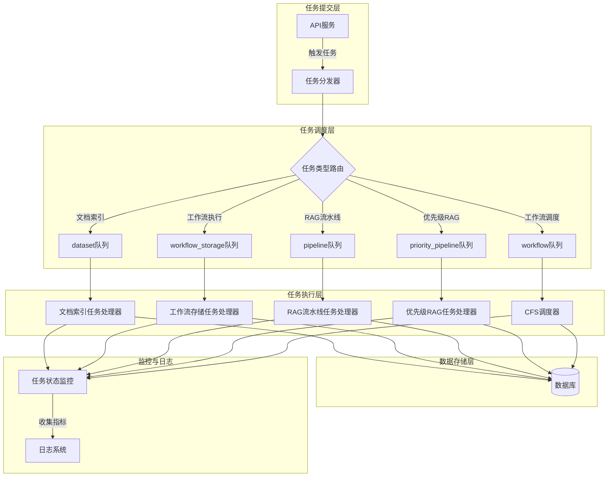
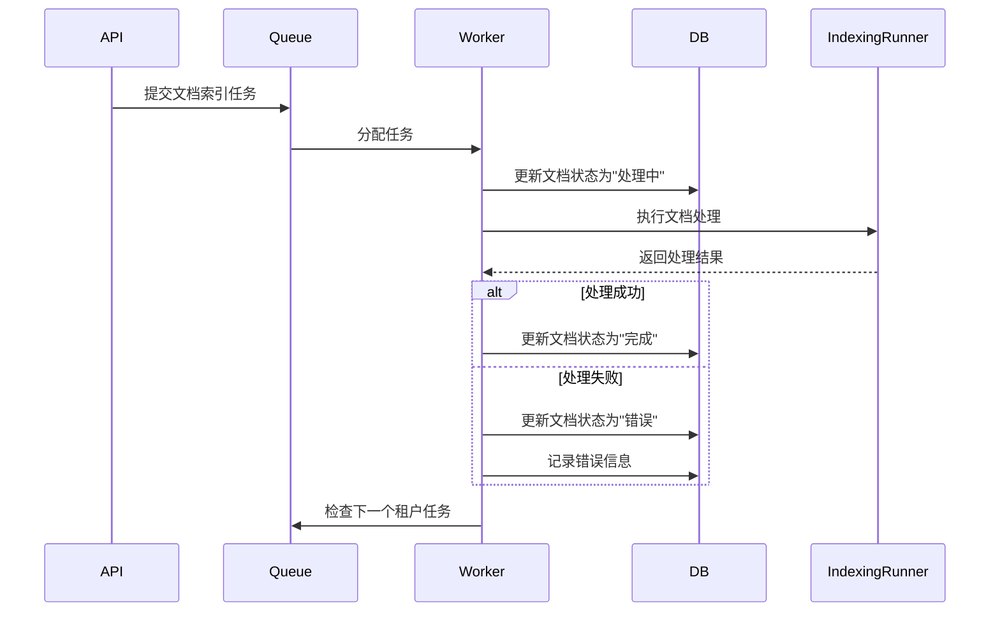

# Dify API 任务系统架构分析

## 目录
- [1. 任务系统整体架构](#1-任务系统整体架构)
- [2. 核心任务模块分析](#2-核心任务模块分析)
- [3. 任务调度与队列机制](#3-任务调度与队列机制)
- [4. 多租户隔离设计](#4-多租户隔离设计)
- [5. 技术架构深度剖析](#5-技术架构深度剖析)
- [6. 架构优化建议](#6-架构优化建议)

## 1. 任务系统整体架构

Dify任务系统采用异步处理架构，基于Celery实现分布式任务调度，通过多队列优先级策略和租户隔离机制，确保任务处理的可靠性、可扩展性和资源隔离性。系统整体架构如下：



### 1.1 架构设计原则

任务系统遵循以下核心架构原则：
- **关注点分离**：任务提交、调度、执行和存储分层设计
- **优先级隔离**：关键业务流程与非关键流程使用不同优先级队列
- **租户隔离**：多租户环境下的资源与数据安全隔离
- **可观测性**：全链路监控与日志采集
- **可扩展性**：支持任务类型与处理能力的水平扩展

## 2. 核心任务模块分析

### 2.1 文档索引任务

**核心文件**：`document_indexing_task.py`

负责文档解析、向量化和索引构建，实现了文档批量处理的异步化。采用**生产者-消费者模式**设计，支持租户级任务队列隔离。

主要功能：
- 文档索引状态生命周期管理（解析中、完成、错误）
- 订阅计划限制检查（批量上传数量、向量空间限制）
- 基于IndexingRunner的文档处理流水线
- 异常处理与任务恢复机制

**关键技术实现**：
```python
@shared_task(queue="dataset")
def document_indexing_task(dataset_id: str, document_ids: list):
    # 文档索引任务实现
    _document_indexing(dataset_id, document_ids)

# 租户隔离的任务处理模式
def _document_indexing_with_tenant_queue(
    tenant_id: str, dataset_id: str, document_ids: Sequence[str], task_func: Callable[[str, str, Sequence[str]], None]
):
    try:
        _document_indexing(dataset_id, document_ids)
    finally:
        # 租户级任务队列处理逻辑
        tenant_isolated_task_queue = TenantIsolatedTaskQueue(tenant_id, "document_indexing")
        next_tasks = tenant_isolated_task_queue.pull_tasks(count=dify_config.TENANT_ISOLATED_TASK_CONCURRENCY)
        if next_tasks:
            # 继续处理下一个任务
            task_func.delay(...)
```

**文档索引工作流**：


### 2.2 工作流执行任务

**核心文件**：`workflow_execution_tasks.py`

负责工作流执行数据的异步存储，采用**仓储模式**设计，减轻主流程响应时间。实现了可靠的任务状态持久化机制。

主要功能：
- 工作流执行记录的创建与更新
- 执行状态跟踪（运行中、完成、失败）
- 执行结果序列化与持久化
- 失败重试机制（最多3次，指数退避策略）

**关键技术特点**：
- 使用SQLAlchemy会话管理实现事务隔离
- 基于WorkflowExecution模型的序列化/反序列化
- 支持工作流执行数据的增量更新
- 乐观锁机制确保并发安全

### 2.3 RAG流水线任务

**核心文件**：`rag_pipeline/rag_pipeline_run_task.py`、`rag_pipeline/priority_rag_pipeline_run_task.py`

实现RAG流水线的异步执行，采用**线程池模式**和**优先级队列模式**设计，分为普通优先级和高优先级两个处理路径。

主要功能：
- 多线程并行处理RAG任务
- 基于文件服务的实体数据传递
- 工作流执行仓库与节点执行仓库集成
- 租户级任务队列隔离

**优先级处理策略**：
- 普通任务：使用"pipeline"队列
- 高优先级任务：使用"priority_pipeline"队列
- 线程池配置：最大10个工作线程

**性能优化**：
- 任务批处理减少数据库交互
- 上下文复制减少线程安全问题
- 文件服务传递大型实体数据

## 3. 任务调度与队列机制

### 3.1 队列设计

系统采用多队列策略实现任务分类处理，通过差异化队列配置实现服务质量保障：

| 队列名称 | 用途 | 优先级 | 资源分配 | 典型任务耗时 |
|---------|------|-------|---------|------------|
| dataset | 文档索引任务 | 中 | 中等CPU/内存 | 秒级-分钟级 |
| workflow_storage | 工作流执行存储 | 中 | 低CPU/高IO | 毫秒级-秒级 |
| pipeline | RAG流水线任务 | 中 | 高CPU/内存 | 秒级-分钟级 |
| priority_pipeline | 优先级RAG任务 | 高 | 最高CPU/内存 | 秒级 |
| workflow | 工作流调度任务 | 中高 | 中等CPU/内存 | 毫秒级-秒级 |

### 3.2 CFS调度策略

**核心文件**：`workflow_cfs_scheduler/entities.py`

基于Completely Fair Scheduler (CFS)实现工作流任务的公平调度，采用**多级队列调度算法**，根据不同版本和租户类型提供差异化服务质量。

**调度策略**：
- 社区版：单队列调度，所有任务共享同一资源池
- 企业版：多队列隔离，基于租户订阅等级分配计算资源
  - 专业版队列：`workflow_professional` - 最高资源优先级
  - 团队版队列：`workflow_team` - 中等资源优先级
  - 沙盒版队列：`workflow_sandbox` - 最低资源优先级

**实现代码**：
```python
# 根据版本和订阅等级确定队列策略
if dify_config.EDITION == "CLOUD":
    # 企业版：多队列隔离与CFS时间片调度
    _professional_queue = "workflow_professional"
    _team_queue = "workflow_team"
    _sandbox_queue = "workflow_sandbox"
    AsyncWorkflowSystemStrategy = WorkflowScheduleCFSPlanEntity.Strategy.TimeSlice
else:
    # 社区版：单队列FIFO调度
    _professional_queue = "workflow"
    _team_queue = "workflow"
    _sandbox_queue = "workflow"
    AsyncWorkflowSystemStrategy = WorkflowScheduleCFSPlanEntity.Strategy.Nop
```

**CFS调度优势**：
- 确保租户间资源公平分配
- 防止单个租户垄断系统资源
- 支持基于订阅等级的资源配额
- 自动适应工作负载变化

## 4. 多租户隔离设计

任务系统通过多层次机制实现多租户隔离，确保数据安全与资源公平使用：

### 4.1 隔离层次

1. **数据隔离**：
   - 数据库行级租户ID过滤
   - 实体查询强制租户上下文验证

2. **资源隔离**：
   - 租户级任务队列隔离
   - 基于租户的资源配额控制
   - 任务并发度限制

3. **执行环境隔离**：
   - 线程本地存储维护租户上下文
   - 租户级配置隔离
   - 独立的错误处理与日志

### 4.2 关键实现

```python
# 租户隔离任务队列实现
class TenantIsolatedTaskQueue:
    def __init__(self, tenant_id: str, task_type: str):
        self.tenant_id = tenant_id
        self.task_type = task_type
        self.redis_key = f"tenant:{tenant_id}:task_queue:{task_type}"

    def push_task(self, task_data: dict):
        # 仅将任务添加到当前租户的队列
        redis_client.rpush(self.redis_key, json.dumps(task_data))

    def pull_tasks(self, count: int = 1):
        # 仅从当前租户的队列拉取任务
        return redis_client.lpop(self.redis_key, count)
```

### 4.3 资源控制策略

- **并发控制**：通过TENANT_ISOLATED_TASK_CONCURRENCY限制单租户并发任务数
- **速率限制**：基于租户等级的任务提交速率限制
- **资源配额**：CPU/内存使用的租户级限制
- **优先级控制**：基于租户订阅等级的任务优先级调整

## 5. 技术架构深度剖析

### 5.1 任务可靠性保障

系统采用多层次保障机制确保任务可靠执行：

1. **重试机制**：
   - 瞬时错误自动重试（最多3次）
   - 指数退避策略（60秒, 120秒, 240秒）
   - 失败任务死信队列

2. **事务管理**：
   - 基于SQLAlchemy的会话事务
   - 任务状态与业务数据一致性保障
   - 分布式锁防止并发冲突

3. **故障恢复**：
   - 任务执行状态持久化
   - 服务重启后任务自动恢复
   - 部分失败的任务支持断点续跑

### 5.2 性能优化策略

1. **异步I/O模型**：
   - 非阻塞数据库操作
   - 异步文件I/O
   - 事件驱动的任务处理

2. **资源管理**：
   - 线程池复用减少创建开销
   - 连接池管理数据库连接
   - 内存缓存热点数据

3. **批处理优化**：
   - 批量任务合并处理
   - 批量数据库操作减少交互
   - 批量文件操作减少I/O次数

### 5.3 扩展性设计

系统采用插件化架构设计，支持任务类型与处理逻辑的灵活扩展：

1. **任务处理器接口**：
   ```python
   class TaskProcessor(ABC):
       @abstractmethod
       def process(self, task_data: dict) -> None:
           pass
            
       @abstractmethod
       def handle_error(self, error: Exception) -> None:
           pass
   ```

2. **队列路由规则**：
   - 基于任务类型的动态路由
   - 支持自定义队列分配策略
   - 可配置的负载均衡规则

3. **水平扩展**：
   - 无状态Worker设计支持任意扩展
   - 基于队列长度的自动扩缩容
   - 跨节点任务分发

## 6. 架构优化建议

### 6.1 性能优化

1. **动态资源调度**：
   - 实现基于系统负载和租户等级的动态优先级调整
   - 开发任务执行时间预测模型，优化资源分配
   - 引入任务预取机制，减少Worker空闲时间

2. **缓存策略增强**：
   - 构建多级缓存架构（内存→Redis→数据库）
   - 实现任务元数据缓存，减少数据库访问
   - 引入结果缓存机制，避免重复计算

3. **计算优化**：
   - 实现任务执行的地理分布式部署，降低延迟
   - 开发任务合并算法，减少小任务开销
   - 优化线程池配置，根据任务类型动态调整

### 6.2 可靠性与韧性增强

1. **故障隔离**：
   - 实现Worker组隔离，防止单点故障影响整个系统
   - 开发细粒度的断路器模式，隔离故障组件
   - 设计降级策略，在系统压力下保障核心功能

2. **数据一致性**：
   - 实现基于最终一致性的任务状态同步机制
   - 引入分布式事务，保障跨服务数据一致性
   - 开发数据修复工具，处理异常状态数据

3. **灾难恢复**：
   - 设计跨区域任务备份机制
   - 实现任务执行状态的实时快照
   - 开发快速故障转移方案，减少恢复时间

### 6.3 可观测性提升

1. **监控体系**：
   - 集成OpenTelemetry实现全链路追踪
   - 开发任务执行热力图，识别瓶颈
   - 构建租户级性能监控面板

2. **日志分析**：
   - 实现结构化日志与关联分析
   - 开发异常检测算法，主动发现问题
   - 构建日志聚合查询平台

3. **告警策略**：
   - 设计多级告警机制，减少告警风暴
   - 实现智能告警路由，精准定位责任人
   - 开发根因分析辅助工具

### 6.4 企业级能力增强

1. **安全强化**：
   - 实现任务数据加密传输与存储
   - 开发细粒度的任务权限控制
   - 引入安全审计日志，记录敏感操作

2. **合规能力**：
   - 实现任务执行的合规性检查点
   - 开发数据留存与清理策略
   - 构建合规审计报告工具

3. **运维效率**：
   - 设计任务模板管理系统
   - 开发批量任务操作工具
   - 实现任务执行的自助诊断工具