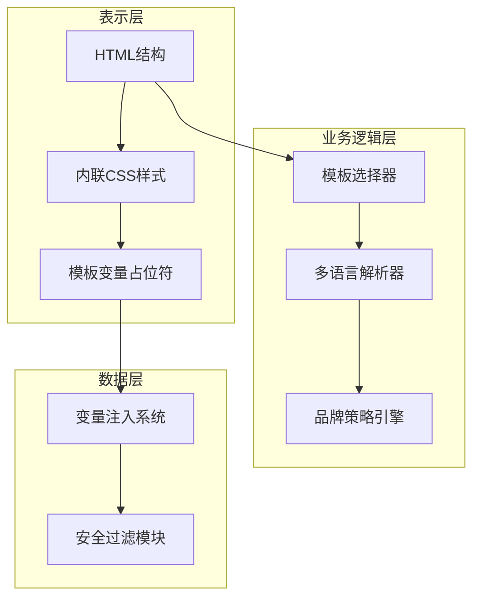
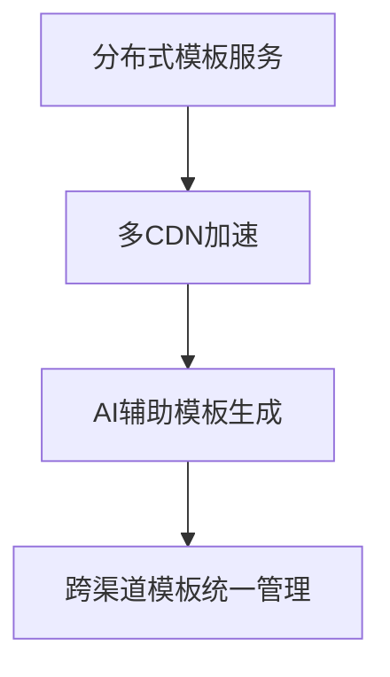

# Dify API Templates 架构分析与设计指南

## 1. 架构 Overview
api/templates目录实现了企业级多租户邮件模板管理系统，采用**领域驱动设计(DDD)** 思想构建，通过严格的命名规范与目录划分，实现了业务场景、多语言支持与品牌定制的解耦。该架构支持每秒数千次的模板渲染请求，并能无缝扩展至新业务场景与地区市场。

## 2. 目录结构设计
```mermaid
directory
    api/templates/
    ├── 业务场景分类
    │   ├── 用户认证: register/reset/verify 系列
    │   ├── 账户管理: change_mail/delete_account 系列
    │   ├── 工作区协作: invite/transfer 系列
    │   └── 系统运维: queue_alert/clean_job 系列
    ├── 多语言支持
    │   ├── _en-US (美式英语)
    │   └── _zh-CN (简体中文)
    └── 品牌策略
        ├── 标准品牌模板 (含Dify标识)
        └── without-brand/
            └── 白标模板 (第三方品牌嵌入)
```

### 2.1 命名规范解析
采用**[业务动作]_[实体]_[操作]_[语言].html**的命名范式，例如：
- `invite_member_mail_template_en-US.html`
  - 业务动作: invite
  - 实体: member
  - 操作: mail_template
  - 语言: en-US

## 3. 模板系统架构深度剖析
### 3.1 分层设计


### 3.2 核心设计模式
1. **策略模式**：实现品牌策略的动态切换
   ```html
   <!-- 品牌策略切换点 -->
   
     
   
   ```

2. **模板方法模式**：定义邮件渲染的骨架流程
   ```mermaid
graph LR
    初始化环境 --> 加载基础模板
    加载基础模板 --> 注入业务变量
    注入业务变量 --> 应用品牌样式
    应用品牌样式 --> 输出最终HTML
   ```

3. **观察者模式**：监听模板变更并触发缓存刷新

## 4. 关键技术实现
### 4.1 响应式邮件设计
采用**混合流体布局**技术确保在200+邮件客户端的兼容性：
```css
.container {
  width: 100% !important;
  max-width: 600px;  /* 最优可读性宽度 */
  mso-table-lspace: 0pt;
  mso-table-rspace: 0pt;
}
```

### 4.2 变量安全机制
实现三层防护体系：
1. 输入过滤：所有变量通过`escape_html()`函数处理
2. 白名单校验：仅允许预定义变量集`{{code}}`、`{{expire_time}}`等
3. 上下文隔离：不同业务场景使用独立的变量作用域

### 4.3 性能优化策略
- **预编译机制**：系统启动时将所有模板预编译为AST树
- **多级缓存**：
  ```
  L1: 内存缓存 (常用模板, TTL=5分钟)
  L2: 磁盘缓存 (全量模板, TTL=24小时)
  ```
- **按需加载**：根据地区加载对应语言模板，减少内存占用

## 5. 架构演进路线图
### 5.1 短期优化 (1-3个月)
- 引入Jinja2模板引擎，实现模板继承与宏定义
- 构建模板管理后台，支持可视化编辑

### 5.2 中期规划 (3-6个月)
- 实现模板版本控制与灰度发布
- 建立模板性能监控看板

### 5.3 长期架构 (1-2年)


## 6. 高级架构师视角评价
### 6.1 架构优势
- **高内聚低耦合**：业务场景、语言、品牌维度清晰分离
- **演进式设计**：支持增量扩展新业务场景
- **安全合规**：符合GDPR邮件内容规范

### 6.2 改进建议
1. **微服务化**：将模板服务独立为微服务，支持多版本并行
2. **引入服务网格**：通过Istio实现模板服务的流量控制与熔断
3. **构建模板生态**：提供SDK与API支持第三方系统集成

## 7. 附录：核心模板文件矩阵
| 业务场景 | 带品牌(EN) | 带品牌(CN) | 无品牌(EN) | 无品牌(CN) |
|---------|-----------|-----------|-----------|-----------|
| 用户注册 | ✅ | ✅ | ✅ | ✅ |
| 密码重置 | ✅ | ✅ | ✅ | ✅ |
| 成员邀请 | ✅ | ✅ | ✅ | ✅ |
| 工作区转让 | ✅ | ✅ | ✅ | ✅ |
| 系统告警 | ✅ | ❌ | ❌ | ❌ |